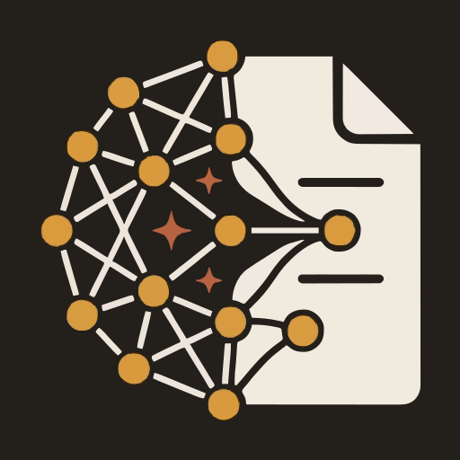

# 🤖 DocuAgent — Agente RAG de Documentación Empresarial

<p align="center">
  
</p>

<p align="center">
  <strong>Agente inteligente de búsqueda y consulta sobre documentación corporativa</strong><br/>
  Powered by RAG (Retrieval-Augmented Generation) con LangGraph, FastAPI y Next.js
</p>

<p align="center">
  <a href="https://docuagent.angelezequiel.dev"><strong>🌐 Demo en vivo</strong></a> •
  <a href="#-características">Características</a> •
  <a href="#-arquitectura">Arquitectura</a> •
  <a href="#-inicio-rápido">Inicio Rápido</a> •
  <a href="#-despliegue">Despliegue</a> •
  <a href="#-documentación">Documentación</a>
</p>

---

## 🌐 Demo en vivo

| Recurso | URL |
|---|---|
| **Aplicación (landing + chat)** | <https://docuagent.angelezequiel.dev> |
| **Chat público** | <https://docuagent.angelezequiel.dev/chat> |
| **API (health check)** | <https://api-docuagent.angelezequiel.dev/api/v1/health> |

> El panel de administración (`/admin`) es privado: requiere email/password,
> verificación anti-bot (Cloudflare Turnstile) y segundo factor TOTP.
> La base de conocimiento de la demo usa documentos de una **empresa ficticia**
> ("Corporativo Nébula") — ver [`backend/documents/`](backend/documents/).
> Preguntas de prueba sugeridas:
> [`docs/development/prueba-rag-preguntas.md`](docs/development/prueba-rag-preguntas.md).

## 📋 Descripción

**DocuAgent** es un agente de IA que permite a los colaboradores de una empresa consultar documentación interna (políticas de RH, procedimientos, normativas financieras, seguridad, etc.) a través de una interfaz conversacional.

El sistema utiliza **RAG (Retrieval-Augmented Generation)** para buscar información relevante en la base de documentos y generar respuestas precisas con citación de fuentes. Si no encuentra información suficiente, **lo dice explícitamente en vez de inventar**.

### ¿Cómo funciona?

```
Colaborador hace una pregunta
        │
        ▼
┌─────────────────┐     ┌──────────────────┐     ┌─────────────────┐
│   Embedding de   │────▶│ Búsqueda en Base │────▶│    Reranking     │
│   la consulta    │     │ Vectorial (top20) │     │ (Cohere, top 5)  │
└─────────────────┘     └──────────────────┘     └────────┬────────┘
                                                           │
                                                           ▼
┌─────────────────┐     ┌──────────────────┐     ┌─────────────────┐
│ Respuesta con   │◀────│ Generación + vali-│◀────│  Ensamblaje de  │
│ citación de     │     │ dación anti-aluci-│     │    contexto     │
│ fuentes [1][2]  │     │ nación (LLM)      │     └─────────────────┘
└─────────────────┘     └──────────────────┘
```

## ✨ Características

- 🔍 **Búsqueda semántica** — Encuentra documentos por significado, no solo por palabras clave
- 📄 **Multi-formato** — PDF, Word, Excel, Markdown, CSV, JSON, HTML y texto plano
- 🌐 **Multilingüe** — Pregunta en español, inglés o portugués (Cohere Embed v3 multilingüe)
- 🔄 **Multi-proveedor LLM** — OpenAI, Google Gemini, Anthropic Claude y Ollama, con **cadena de fallback** automática
- 📊 **Reranking inteligente** — Cohere Rerank v3 para precisión superior
- 📎 **Citación de fuentes** — Cada respuesta referencia documento y página; el validador anti-alucinación fuerza una respuesta honesta cuando no hay evidencia
- 💬 **Chat en streaming** — Respuestas token a token por WebSocket, con historial multi-sesión en el navegador y feedback 👍/👎
- 🏷️ **Categorías dinámicas** — CRUD de categorías (RH, Finanzas, Seguridad, General…)
- 🔐 **Seguridad end-to-end** — Login con Turnstile + TOTP 2FA, cookie httponly, rate limiting, sanitización anti prompt-injection, validación de uploads por magic bytes, escaneo de vulnerabilidades en CI
- 🎨 **Doble tema** — Light/Dark mode con persistencia, 100% responsive (mobile-first)
- 🐳 **Containerizado** — Todo el stack corre en Podman/Docker (5 servicios vía compose)
- ☁️ **Desplegado en OCI** — VM ARM (Ampere) con Cloudflare Tunnel: ningún puerto expuesto a internet

## 🏗️ Arquitectura

```
┌─────────────────────────────────────────────────────────────┐
│                        FRONTEND                              │
│                   Next.js (React + TypeScript)                │
│    ┌──────────┐  ┌──────────┐  ┌──────────┐  ┌──────────┐  │
│    │ Landing  │  │   Chat   │  │  Upload  │  │  Admin   │  │
│    │  Page    │  │(WebSocket)│  │  Docs    │  │  Panel   │  │
│    └──────────┘  └──────────┘  └──────────┘  └──────────┘  │
└────────────────────────┬────────────────────────────────────┘
                         │ HTTP/WebSocket (Cloudflare Tunnel)
┌────────────────────────▼────────────────────────────────────┐
│                     API                                      │
│                 FastAPI (Python 3.12)                         │
│    ┌──────────┐  ┌──────────┐  ┌──────────┐  ┌──────────┐  │
│    │ /chat    │  │/documents │  │/categories│  │ /health  │  │
│    │ (WS)     │  │ (admin)   │  │ (admin)  │  │ /ready   │  │
│    └────┬─────┘  └──────────┘  └──────────┘  └──────────┘  │
└─────────┼───────────────────────────────────────────────────┘
          │
┌─────────▼───────────────────────────────────────────────────┐
│                  AGENT ORCHESTRATION                          │
│                   LangGraph (grafo de estado)                 │
│   query_analyzer → retriever → reranker → context_builder    │
│        → generator → validator   (+ fallback honesto)        │
└─────────┬──────────┬──────────────┬─────────────┬───────────┘
          │          │              │             │
     ┌────▼───┐ ┌───▼────┐  ┌─────▼─────┐ ┌────▼──────┐
     │Cohere  │ │ Qdrant │  │PostgreSQL │ │LLM Provider│
     │Embed v3│ │Vector  │  │ Metadata  │ │(multi +   │
     │+Rerank │ │  DB    │  │ & Audit   │ │ fallback) │
     └────────┘ └────────┘  └───────────┘ └───────────┘
```

> Arquitectura detallada, diagramas y decisiones: [`docs/architecture/`](docs/architecture/)

## 🛠️ Tech Stack

| Capa | Tecnología | Justificación |
|------|-----------|---------------|
| **Lenguaje** | Python 3.12 | Ecosistema maduro para IA/ML |
| **Orquestación IA** | LangGraph | Grafo de estado, control fino del flujo RAG |
| **API Backend** | FastAPI | Async, OpenAPI, Pydantic |
| **Frontend** | Next.js 16 (React 19 + TypeScript) | App Router, SSR, tipado estricto |
| **Base Vectorial** | Qdrant | Open-source, alto rendimiento, containerizable |
| **Base Relacional** | PostgreSQL 16 + Alembic | Metadatos, auditoría, migraciones |
| **Embeddings** | Cohere Embed v3 (multilingual) | ES/EN/PT nativo, 1024 dims |
| **Reranking** | Cohere Rerank v3 | Alta precisión, multilingüe |
| **LLM** | Multi-proveedor (Gemini activo; OpenAI/Claude/Ollama de respaldo) | Flexibilidad y fallback |
| **Contenedores** | Podman/Docker + Compose | 5 servicios, redes aisladas, no-root |
| **CI/CD** | GitHub Actions | Lint + tests + build + escaneo (Trivy) |
| **Cloud** | Oracle Cloud Infrastructure + Cloudflare | VM ARM + Tunnel (sin puertos abiertos) |
| **Testing** | pytest (backend) + Vitest (frontend) | Corren en CI y en la imagen de pruebas |

## 🚀 Inicio Rápido

Todo corre en contenedores — solo necesitas **Git** y **Podman** (o Docker).

```bash
# 1. Clonar el repositorio
git clone https://github.com/EzequielAngel0/AluraAgente.git
cd AluraAgente

# 2. Configurar variables de entorno
cp .env.example .env
# Editar .env: como mínimo COHERE_API_KEY y una clave de LLM (p. ej. GEMINI_API_KEY)

# 3. Levantar el stack (Windows / PowerShell)
.\ops\docuagent.ps1 up-local

#    …o directamente con compose (Linux/Mac)
podman compose -f podman-compose.yml --env-file .env up -d --build

# 4. Cargar los documentos de ejemplo (empresa ficticia)
podman compose -f podman-compose.yml --env-file .env run --rm backend python -m app.scripts.seed_documents

# 5. Abrir
# - Frontend:  http://localhost:3000
# - API docs:  http://localhost:8000/docs
```

El admin semilla se crea al arrancar con las credenciales de `.env`
(`ADMIN_EMAIL`, `ADMIN_PASSWORD`, `ADMIN_TOTP_SECRET`).

## 🧪 Testing

Lint y tests corren **dentro de contenedores** (misma versión que producción) y en CI:

```bash
# Backend — imagen de pruebas (ruff + mypy + pytest)
podman build -f backend/Containerfile --target test -t docuagent-backend-test backend
podman run --rm docuagent-backend-test pytest

# Frontend — lint + tests + build dentro de su imagen
podman build -f frontend/Containerfile -t docuagent-frontend frontend
```

Prueba funcional del RAG (14 preguntas que cubren éxito, multi-fuente,
multilingüe, fallback e inyección de prompt):
[`docs/development/prueba-rag-preguntas.md`](docs/development/prueba-rag-preguntas.md).

## 📦 Despliegue

**Producción real de este proyecto**: una VM ARM (Ampere, 1 OCPU/6 GB) en
Oracle Cloud corriendo los 5 contenedores vía compose, con **Cloudflare
Tunnel** como único punto de entrada (la VM no expone ningún puerto a
internet) y HTTPS automático de Cloudflare.

```bash
# En la VM (modo build local, sin registro de imágenes):
#   .env.prod con DEPLOY_MODE=local + secretos reales
./ops/docuagent.sh build     # construye backend + frontend en la VM (ARM64 nativo)
./ops/docuagent.sh migrate   # migraciones Alembic
./ops/docuagent.sh up        # levanta el stack + túnel
./ops/docuagent.sh seed      # indexa los documentos de ejemplo
```

También existe un pipeline de deploy automático (build → OCIR → SSH a la VM)
en GitHub Actions, gateado por la variable `DEPLOY_ENABLED`.

> Guías completas: [`docs/deployment/`](docs/deployment/) ·
> Infra como código (Terraform): [`infra/terraform/`](infra/terraform/)

## 📚 Documentación

| Documento | Descripción |
|-----------|-------------|
| [`docs/architecture/`](docs/architecture/) | Arquitectura, diagramas, seguridad y auditoría |
| [`docs/pipeline/`](docs/pipeline/) | Pipeline RAG completo (colecta → respuesta) |
| [`docs/api/`](docs/api/) | API REST + protocolo WebSocket del chat |
| [`docs/deployment/`](docs/deployment/) | Contenedores, staging, OCI, CI/CD |
| [`docs/development/`](docs/development/) | Setup, git workflow, testing, prueba del RAG |
| [`docs/project/`](docs/project/) | Fases, decisiones técnicas (ADRs), pendientes |
| [`docs/legal/`](docs/legal/) | Aviso de privacidad y términos (borradores) |
| [`docs/README.md`](docs/README.md) | Índice completo de la documentación |

## 📁 Estructura del Proyecto

```
AluraAgente/
├── backend/
│   ├── app/
│   │   ├── api/v1/            # Endpoints REST + WebSocket
│   │   ├── agent/             # Grafo LangGraph (6 nodos + fallback)
│   │   ├── rag/               # Embeddings, vector store, reranker, retrieval
│   │   ├── ingestion/         # Extractores, limpieza, chunking, indexado
│   │   ├── providers/         # Multi-LLM (OpenAI/Gemini/Claude/Ollama) + factory
│   │   ├── models/            # SQLAlchemy ORM + esquemas Pydantic
│   │   ├── core/              # Config, logging, seguridad, sanitizador
│   │   └── scripts/           # Seed de documentos
│   ├── documents/             # Documentos de ejemplo (empresa ficticia)
│   ├── alembic/               # Migraciones PostgreSQL
│   ├── tests/                 # Unit + integration (pytest)
│   └── Containerfile          # Multi-stage: builder → test → runtime
├── frontend/
│   ├── src/app/               # Landing · /chat · /admin (App Router)
│   ├── src/components/        # chat/ · landing/ · layout/ · admin/
│   ├── src/middleware.ts      # Guard de /admin
│   └── Containerfile
├── docs/                      # Documentación completa
├── infra/terraform/           # Red y VM en OCI como código
├── ops/                       # Runners: docuagent.ps1 (dev) · docuagent.sh (prod)
├── .github/workflows/         # CI (lint+tests+Trivy) · Deploy (gateado)
├── podman-compose.yml         # Base + overrides dev/prod/prod-local
└── .env.example               # Plantilla de configuración comentada
```

## 📄 Licencia

Este proyecto está bajo la Licencia MIT — ver [LICENSE](LICENSE).

---

<p align="center">
  Desarrollado como parte del programa de formación en IA de <strong>Alura LATAM</strong> 🚀
</p>
