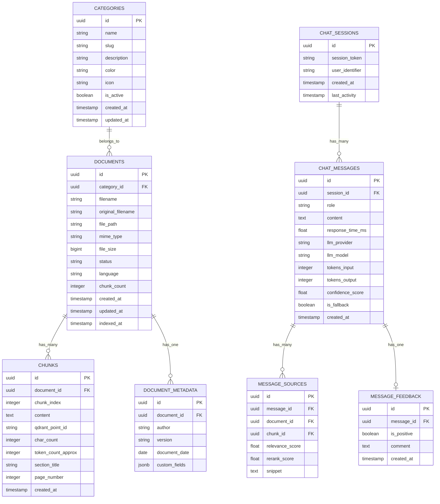

# 🗄️ Diseño de Base de Datos

## Bases de Datos del Sistema

El sistema utiliza **dos bases de datos complementarias**:

| BD | Motor | Propósito |
|----|-------|-----------|
| **Vectorial** | Qdrant | Almacenamiento y búsqueda de embeddings |
| **Relacional** | PostgreSQL | Metadatos, categorías, logs, feedback, sesiones |

---

## PostgreSQL — Modelo Relacional

### Diagrama Entidad-Relación



### Tablas Detalladas

#### `categories`
Categorías dinámicas de documentos, configurables por el administrador.

| Columna | Tipo | Nullable | Descripción |
|---------|------|----------|-------------|
| `id` | UUID | NO | PK, generado automáticamente |
| `name` | VARCHAR(100) | NO | Nombre de la categoría |
| `slug` | VARCHAR(100) | NO | Slug URL-friendly (UNIQUE) |
| `description` | TEXT | SÍ | Descripción opcional |
| `color` | VARCHAR(7) | SÍ | Color hex (#3498db) |
| `icon` | VARCHAR(50) | SÍ | Nombre del icono |
| `is_active` | BOOLEAN | NO | Si la categoría está activa (default: true) |
| `created_at` | TIMESTAMPTZ | NO | Fecha de creación |
| `updated_at` | TIMESTAMPTZ | NO | Última actualización |

#### `documents`
Registro de cada documento cargado al sistema.

| Columna | Tipo | Nullable | Descripción |
|---------|------|----------|-------------|
| `id` | UUID | NO | PK |
| `category_id` | UUID | NO | FK → categories.id |
| `filename` | VARCHAR(255) | NO | Nombre interno del archivo |
| `original_filename` | VARCHAR(500) | NO | Nombre original del archivo |
| `file_path` | VARCHAR(1000) | NO | Ruta al archivo almacenado |
| `mime_type` | VARCHAR(100) | NO | Tipo MIME del archivo |
| `file_size` | BIGINT | NO | Tamaño en bytes |
| `status` | VARCHAR(20) | NO | `pending`, `processing`, `indexed`, `error` |
| `language` | VARCHAR(10) | SÍ | Idioma detectado (es, en, pt) |
| `chunk_count` | INTEGER | SÍ | Cantidad de chunks generados |
| `created_at` | TIMESTAMPTZ | NO | Fecha de carga |
| `updated_at` | TIMESTAMPTZ | NO | Última actualización |
| `indexed_at` | TIMESTAMPTZ | SÍ | Fecha de indexación exitosa |

#### `chunks`
Fragmentos de texto generados a partir de cada documento.

| Columna | Tipo | Nullable | Descripción |
|---------|------|----------|-------------|
| `id` | UUID | NO | PK |
| `document_id` | UUID | NO | FK → documents.id |
| `chunk_index` | INTEGER | NO | Orden del chunk en el documento |
| `content` | TEXT | NO | Texto del chunk |
| `qdrant_point_id` | VARCHAR(100) | SÍ | ID del punto en Qdrant |
| `char_count` | INTEGER | NO | Cantidad de caracteres |
| `token_count_approx` | INTEGER | SÍ | Tokens aproximados |
| `section_title` | VARCHAR(500) | SÍ | Título de sección del documento |
| `page_number` | INTEGER | SÍ | Número de página (si aplica) |
| `created_at` | TIMESTAMPTZ | NO | Fecha de creación |

#### `chat_sessions`
Sesiones de conversación para mantener historial.

| Columna | Tipo | Nullable | Descripción |
|---------|------|----------|-------------|
| `id` | UUID | NO | PK |
| `session_token` | VARCHAR(255) | NO | Token de sesión (UNIQUE) |
| `user_identifier` | VARCHAR(255) | SÍ | Identificador opcional del usuario |
| `created_at` | TIMESTAMPTZ | NO | Inicio de la sesión |
| `last_activity` | TIMESTAMPTZ | NO | Última actividad |

#### `chat_messages`
Cada mensaje (pregunta del usuario o respuesta del agente).

| Columna | Tipo | Nullable | Descripción |
|---------|------|----------|-------------|
| `id` | UUID | NO | PK |
| `session_id` | UUID | NO | FK → chat_sessions.id |
| `role` | VARCHAR(20) | NO | `user` o `assistant` |
| `content` | TEXT | NO | Contenido del mensaje |
| `response_time_ms` | FLOAT | SÍ | Tiempo de respuesta (ms) |
| `llm_provider` | VARCHAR(50) | SÍ | Proveedor LLM usado |
| `llm_model` | VARCHAR(100) | SÍ | Modelo LLM usado |
| `tokens_input` | INTEGER | SÍ | Tokens de entrada |
| `tokens_output` | INTEGER | SÍ | Tokens de salida |
| `confidence_score` | FLOAT | SÍ | Confianza del retrieval (0-1) |
| `is_fallback` | BOOLEAN | NO | Si fue respuesta de fallback |
| `created_at` | TIMESTAMPTZ | NO | Fecha del mensaje |

#### `message_sources`
Fuentes citadas en cada respuesta del agente.

| Columna | Tipo | Nullable | Descripción |
|---------|------|----------|-------------|
| `id` | UUID | NO | PK |
| `message_id` | UUID | NO | FK → chat_messages.id |
| `document_id` | UUID | NO | FK → documents.id |
| `chunk_id` | UUID | NO | FK → chunks.id |
| `relevance_score` | FLOAT | NO | Score de similitud vectorial |
| `rerank_score` | FLOAT | SÍ | Score del reranker |
| `snippet` | TEXT | NO | Fragmento relevante del chunk |

#### `message_feedback`
Feedback del usuario sobre cada respuesta.

| Columna | Tipo | Nullable | Descripción |
|---------|------|----------|-------------|
| `id` | UUID | NO | PK |
| `message_id` | UUID | NO | FK → chat_messages.id (UNIQUE) |
| `is_positive` | BOOLEAN | NO | Positivo o negativo |
| `comment` | TEXT | SÍ | Comentario opcional |
| `created_at` | TIMESTAMPTZ | NO | Fecha del feedback |

---

## Qdrant — Modelo Vectorial

### Colección: `documents`

```json
{
  "collection_name": "documents",
  "vectors": {
    "size": 1024,
    "distance": "Cosine"
  },
  "optimizers_config": {
    "indexing_threshold": 20000
  },
  "hnsw_config": {
    "m": 16,
    "ef_construct": 100
  }
}
```

### Estructura de un Punto (Point)

Cada punto en Qdrant representa un chunk de documento:

```json
{
  "id": "550e8400-e29b-41d4-a716-446655440000",
  "vector": [0.0123, -0.0456, 0.0789, "... (1024 dimensiones)"],
  "payload": {
    "document_id": "d47f3c2a-...",
    "chunk_id": "c89a1b2c-...",
    "chunk_index": 3,
    "content": "El texto del fragmento...",
    "category_id": "cat-rh-001",
    "category_name": "Recursos Humanos",
    "filename": "politica_vacaciones_2024.pdf",
    "section_title": "Días de vacaciones por antigüedad",
    "page_number": 5,
    "language": "es",
    "document_date": "2024-01-15",
    "indexed_at": "2026-06-27T10:30:00Z"
  }
}
```

### Payload Fields (Filtros)

Los campos del payload que se usarán como filtros en la búsqueda:

| Campo | Tipo Qdrant | Uso en Filtro |
|-------|-------------|---------------|
| `category_id` | Keyword | Filtrar por categoría |
| `category_name` | Keyword | Filtrar por nombre de categoría |
| `language` | Keyword | Filtrar por idioma |
| `document_id` | Keyword | Filtrar por documento específico |
| `filename` | Keyword | Filtrar por nombre de archivo |
| `document_date` | Datetime | Filtrar por rango de fechas |
| `indexed_at` | Datetime | Filtrar por fecha de indexación |

### Ejemplo de Query con Filtro

```json
{
  "vector": [0.0123, -0.0456, "..."],
  "limit": 20,
  "filter": {
    "must": [
      {
        "key": "category_name",
        "match": { "value": "Recursos Humanos" }
      }
    ]
  },
  "with_payload": true
}
```

---

## Índices PostgreSQL

```sql
-- Categorías
CREATE UNIQUE INDEX idx_categories_slug ON categories(slug);

-- Documentos
CREATE INDEX idx_documents_category_id ON documents(category_id);
CREATE INDEX idx_documents_status ON documents(status);
CREATE INDEX idx_documents_created_at ON documents(created_at DESC);

-- Chunks
CREATE INDEX idx_chunks_document_id ON chunks(document_id);
CREATE INDEX idx_chunks_qdrant_point_id ON chunks(qdrant_point_id);

-- Chat
CREATE INDEX idx_chat_sessions_token ON chat_sessions(session_token);
CREATE INDEX idx_chat_messages_session_id ON chat_messages(session_id);
CREATE INDEX idx_chat_messages_created_at ON chat_messages(created_at DESC);

-- Feedback
CREATE UNIQUE INDEX idx_feedback_message_id ON message_feedback(message_id);
CREATE INDEX idx_feedback_is_positive ON message_feedback(is_positive);

-- Fuentes
CREATE INDEX idx_sources_message_id ON message_sources(message_id);
CREATE INDEX idx_sources_document_id ON message_sources(document_id);
```

## Migraciones (Alembic)

```
alembic/
├── env.py
├── alembic.ini
└── versions/
    ├── 001_initial_schema.py
    ├── 002_add_categories.py
    ├── 003_add_documents.py
    ├── 004_add_chunks.py
    ├── 005_add_chat_sessions.py
    ├── 006_add_chat_messages.py
    ├── 007_add_sources_and_feedback.py
    └── ...
```
