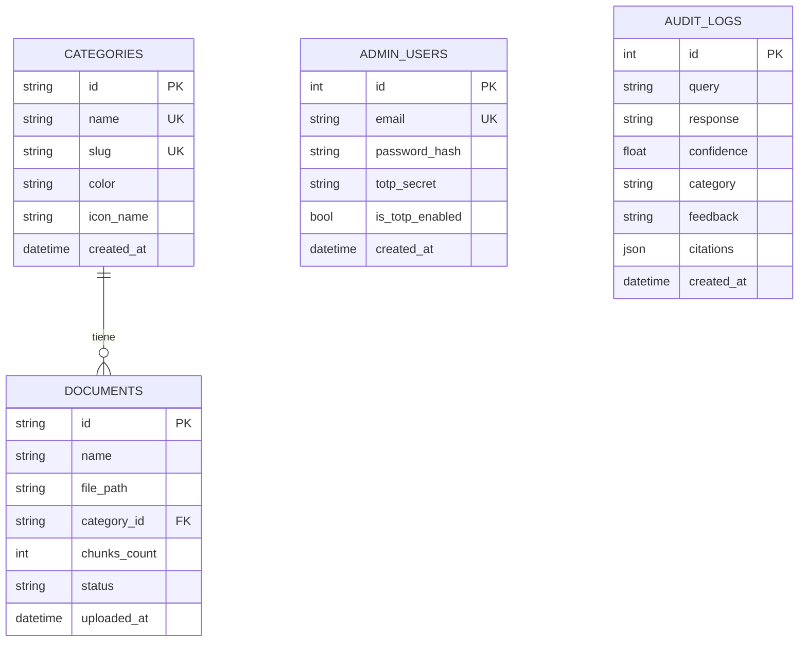

# 🗄️ Diseño de Base de Datos

El sistema usa **dos almacenes complementarios**:

| BD | Motor | Propósito |
|----|-------|-----------|
| **Relacional** | PostgreSQL 16 | Admin, categorías, documentos, auditoría de consultas |
| **Vectorial** | Qdrant | Embeddings de los fragmentos (chunks) + búsqueda |

> Esta página describe el esquema **real** (migración inicial de Alembic
> `7ea92cfb1b83`). Los **chunks NO se guardan en PostgreSQL**: viven únicamente
> en Qdrant como puntos. La auditoría de cada consulta del chat se registra de
> forma desnormalizada en `audit_logs` (con sus citas en JSON), en lugar del
> modelo más granular sesiones/mensajes. Ver _Evolución futura_ al final.

---

## PostgreSQL — Modelo relacional

### Diagrama Entidad-Relación



### Tablas

#### `admin_users`
Administradores del panel (login email/password + TOTP). Se siembra/sincroniza
al arrancar desde `ADMIN_EMAIL` / `ADMIN_PASSWORD` / `ADMIN_TOTP_SECRET`.

| Columna | Tipo | Nullable | Notas |
|---------|------|----------|-------|
| `id` | INTEGER | NO | PK |
| `email` | VARCHAR(255) | NO | UNIQUE, index |
| `password_hash` | VARCHAR(255) | NO | bcrypt |
| `totp_secret` | VARCHAR(255) | SÍ | base32 |
| `is_totp_enabled` | BOOLEAN | NO | default false |
| `created_at` | DATETIME | NO | |

#### `categories`
Categorías dinámicas (CRUD desde el admin). El `id` es una cadena corta
(`cat_xxxx`). Se siembran 4 por defecto si la tabla está vacía.

| Columna | Tipo | Nullable | Notas |
|---------|------|----------|-------|
| `id` | VARCHAR(50) | NO | PK |
| `name` | VARCHAR(100) | NO | UNIQUE |
| `slug` | VARCHAR(100) | NO | UNIQUE |
| `color` | VARCHAR(50) | NO | etiqueta de color UI |
| `icon_name` | VARCHAR(50) | NO | icono lucide-react |
| `created_at` | DATETIME | NO | |

#### `documents`
Un registro por documento cargado. El borrado de una categoría elimina en
cascada sus documentos (`ondelete=CASCADE`).

| Columna | Tipo | Nullable | Notas |
|---------|------|----------|-------|
| `id` | VARCHAR(50) | NO | PK (`doc_xxxx`) |
| `name` | VARCHAR(255) | NO | nombre original |
| `file_path` | VARCHAR(512) | NO | ruta en `UPLOAD_DIR` |
| `category_id` | VARCHAR(50) | NO | FK → categories.id |
| `chunks_count` | INTEGER | NO | nº de chunks indexados |
| `status` | VARCHAR(20) | NO | `Indexando` · `Indexado` · `Fallo` |
| `uploaded_at` | DATETIME | NO | |

#### `audit_logs`
Auditoría de cada consulta del chat (pregunta, respuesta, confianza, categoría,
citas y feedback). Alimenta el historial del admin y el botón 👍/👎.

| Columna | Tipo | Nullable | Notas |
|---------|------|----------|-------|
| `id` | INTEGER | NO | PK |
| `query` | VARCHAR(1024) | NO | pregunta |
| `response` | VARCHAR(4096) | NO | respuesta generada |
| `confidence` | FLOAT | NO | máxima confianza de los chunks usados |
| `category` | VARCHAR(100) | NO | filtro aplicado o `General` |
| `feedback` | VARCHAR(20) | SÍ | `positive` · `negative` · NULL |
| `citations` | JSON | SÍ | lista de citas (doc, página, snippet) |
| `created_at` | DATETIME | NO | |

---

## Qdrant — Modelo vectorial

### Colección `documents`

- **Tamaño de vector**: 1024 (`QDRANT_VECTOR_SIZE`) — Cohere
  `embed-multilingual-v3.0`.
- **Distancia**: Cosine.
- Creada automáticamente al arrancar (`vector_store.ensure_collection()`).

### Payload de cada punto (chunk)

```json
{
  "id": "uuid-v4",
  "vector": [/* 1024 floats */],
  "payload": {
    "document_id": "doc_ab12cd34",
    "document_name": "politica_vacaciones_2024.pdf",
    "category": "Recursos Humanos",
    "page": 5,
    "content": "El texto del fragmento..."
  }
}
```

### Filtros de búsqueda

| Campo | Tipo | Uso |
|-------|------|-----|
| `category` | Keyword | Filtrar por categoría (chat con filtro) |
| `document_id` | Keyword | Borrado/inspección de un documento |

El umbral de relevancia se aplica sobre el **score de Cohere Rerank**
(`CONFIDENCE_THRESHOLD`), no sobre el score vectorial crudo.

---

## Migraciones (Alembic)

```
backend/alembic/
├── env.py                          # target_metadata = app.models.orm.Base
└── versions/
    └── 7ea92cfb1b83_initial.py     # admin_users, categories, documents, audit_logs
```

- Generar: `alembic revision --autogenerate -m "mensaje"`
- Aplicar: `alembic upgrade head` (el Containerfile lo ejecuta al arrancar).

---

## Evolución futura (no implementado)

Para historial conversacional granular y trazabilidad fina se podría migrar a:
`chat_sessions → chat_messages → message_sources` y una tabla `chunks` en
PostgreSQL (espejo del punto de Qdrant con `qdrant_point_id`). Hoy se prioriza
la simplicidad: el historial es plano (`audit_logs`) y el chunk es la fuente de
verdad en Qdrant. Cualquier cambio aquí requiere nueva migración Alembic y
ajustar el endpoint `/admin/history` y el WebSocket de chat.
