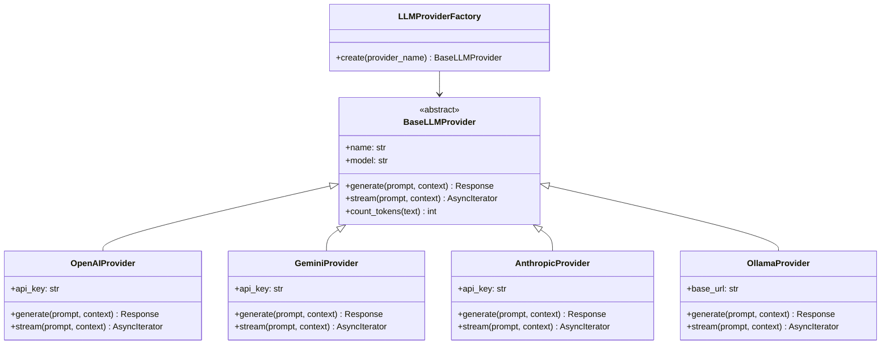

# 🤖 Estrategia Multi-Proveedor LLM

## Visión General

DocuAgent implementa una **capa de abstracción** que permite cambiar entre múltiples proveedores de LLM sin modificar código. Esto proporciona:

- **Flexibilidad**: Optimizar costo vs. calidad según el caso de uso
- **Resiliencia**: Fallback automático si un proveedor falla
- **Desarrollo local**: Usar Ollama sin costo de API
- **Evaluación**: Comparar proveedores con LangSmith

## Proveedores Soportados

| Proveedor | Modelos Principales | Caso de Uso | Costo Aproximado |
|-----------|-------------------|-------------|------------------|
| **OpenAI** | GPT-4o, GPT-4o-mini | Producción (balance calidad/costo) | $2.50-$10 / 1M tokens |
| **Google Gemini** | 2.5 Pro, 2.5 Flash | Contextos largos, multimodal | $1.25-$10 / 1M tokens |
| **Anthropic** | Claude 4, Sonnet 4 | Instrucciones complejas, razonamiento | $3-$15 / 1M tokens |
| **Ollama** | Llama 3.1, Mistral, Qwen | Desarrollo local, privacidad | Gratis (hardware local) |

## Arquitectura



## Configuración

La selección del proveedor se hace por variable de entorno:

```env
# Proveedor activo
LLM_PROVIDER=openai        # openai | gemini | anthropic | ollama

# Modelo a usar
LLM_MODEL=gpt-4o-mini      # Varía por proveedor

# Temperatura (0.0 = determinista, 1.0 = creativo)
LLM_TEMPERATURE=0.1         # Bajo para RAG (respuestas factuales)

# Tokens máximos de respuesta
LLM_MAX_TOKENS=2048

# API Keys (solo la del proveedor activo es requerida)
OPENAI_API_KEY=sk-...
GEMINI_API_KEY=AI...
ANTHROPIC_API_KEY=sk-ant-...

# Ollama (local)
OLLAMA_BASE_URL=http://localhost:11434
OLLAMA_MODEL=llama3.1:8b
```

## Modelos Recomendados por Proveedor

### OpenAI
| Modelo | Tokens | Velocidad | Calidad | Uso recomendado |
|--------|--------|-----------|---------|-----------------|
| `gpt-4o` | 128K | Media | Excelente | Producción (preguntas complejas) |
| `gpt-4o-mini` | 128K | Rápida | Muy buena | Producción (volumen alto, buen costo) |

### Google Gemini
| Modelo | Tokens | Velocidad | Calidad | Uso recomendado |
|--------|--------|-----------|---------|-----------------|
| `gemini-2.5-pro` | 1M | Media | Excelente | Documentos largos, razonamiento |
| `gemini-2.5-flash` | 1M | Muy rápida | Buena | Alto volumen, costo bajo |

### Anthropic
| Modelo | Tokens | Velocidad | Calidad | Uso recomendado |
|--------|--------|-----------|---------|-----------------|
| `claude-4-sonnet` | 200K | Media | Excelente | Instrucciones precisas, compliance |
| `claude-4-haiku` | 200K | Rápida | Buena | Volumen alto |

### Ollama (Local)
| Modelo | RAM necesaria | Velocidad | Calidad | Uso recomendado |
|--------|--------------|-----------|---------|-----------------|
| `llama3.1:8b` | 8GB | Media | Buena | Desarrollo local |
| `mistral:7b` | 8GB | Rápida | Buena | Desarrollo local |
| `qwen2.5:7b` | 8GB | Media | Buena | Multilingüe local |

## Fallback Chain

```python
# Orden de fallback si el proveedor principal falla
FALLBACK_CHAIN = ["openai", "gemini", "anthropic", "ollama"]
```

Si el proveedor configurado falla (timeout, rate limit, error de API):
1. Registrar el error en LangSmith
2. Intentar con el siguiente proveedor en la cadena
3. Si todos fallan, devolver error al usuario

## Integración con LangGraph

Cada proveedor se integra como un componente intercambiable en el nodo `generator` del grafo LangGraph:

```python
# agent/nodes/generator.py
from app.providers.factory import LLMProviderFactory

async def generate_response(state: AgentState) -> AgentState:
    provider = LLMProviderFactory.create(settings.llm_provider)

    response = await provider.generate(
        system_prompt=RAG_SYSTEM_PROMPT,
        context=state["context"],
        query=state["query"],
        chat_history=state["messages"],
    )

    return {
        **state,
        "response": response.content,
        "sources": state["reranked_chunks"],
    }
```
