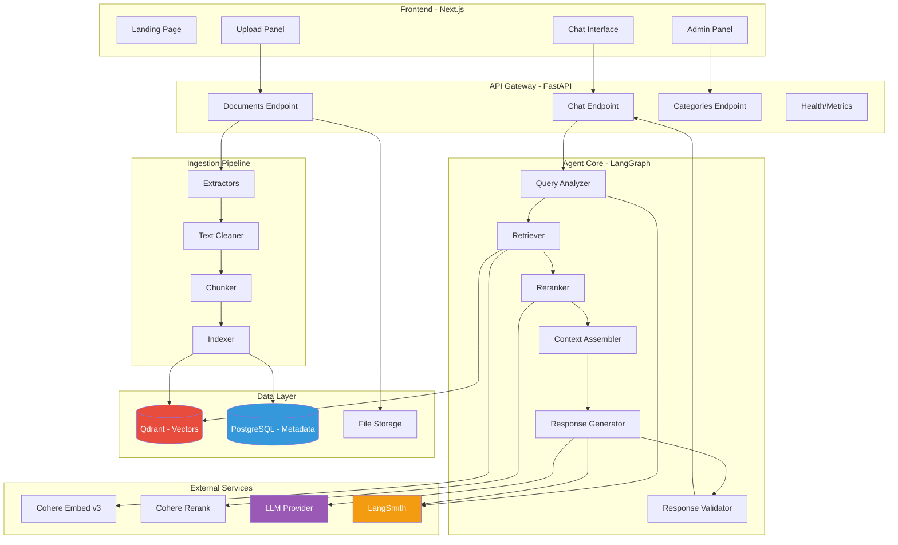
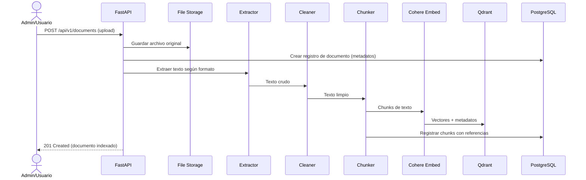
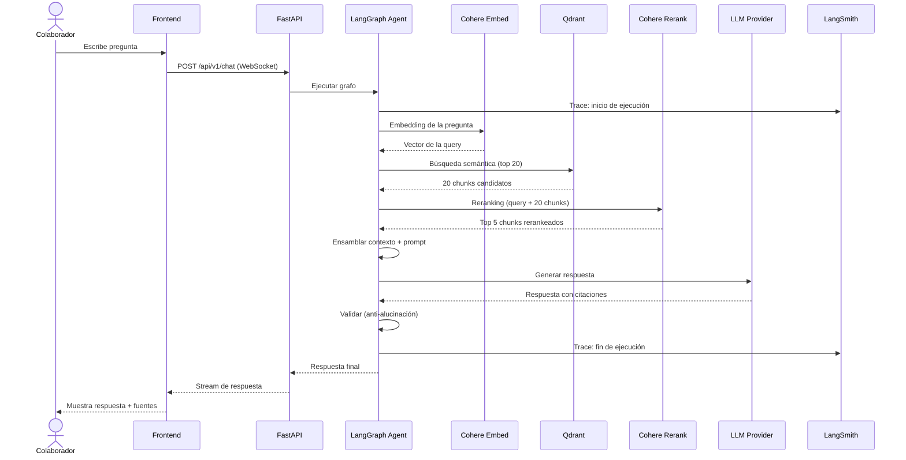

# 🏗️ Arquitectura del Sistema — Visión General

## Diagrama de Alto Nivel

## Capas de la Arquitectura

### 1. Capa de Presentación (Frontend)

| Componente | Tecnología | Responsabilidad |
|------------|-----------|-----------------|
| Landing Page | Next.js (SSR) | Página de presentación del proyecto |
| Chat Interface | Next.js (CSR) | Interfaz conversacional con el agente |
| Upload Panel | Next.js (CSR) | Carga y gestión de documentos |
| Admin Panel | Next.js (CSR) | Administración de categorías y documentos |

### 2. Capa de API (Backend Gateway)

| Componente | Tecnología | Responsabilidad |
|------------|-----------|-----------------|
| Chat API | FastAPI + WebSocket | Recibe preguntas, streaming de respuestas |
| Documents API | FastAPI REST | CRUD de documentos, carga de archivos |
| Categories API | FastAPI REST | CRUD de categorías dinámicas |
| Health/Metrics | FastAPI | Health checks, métricas básicas |

### 3. Capa de Agente (Orquestación)

| Componente | Tecnología | Responsabilidad |
|------------|-----------|-----------------|
| Query Analyzer | LangGraph node | Analiza la intención de la pregunta |
| Retriever | LangGraph node | Búsqueda semántica en Qdrant |
| Reranker | LangGraph node | Reclasificación con Cohere Rerank |
| Context Assembler | LangGraph node | Ensamblaje del contexto para el LLM |
| Response Generator | LangGraph node | Generación de respuesta con LLM |
| Response Validator | LangGraph node | Validación anti-alucinación |

### 4. Capa de Datos

| Componente | Tecnología | Responsabilidad |
|------------|-----------|-----------------|
| Vector Store | Qdrant | Embeddings y búsqueda semántica |
| Relational DB | PostgreSQL | Metadatos, logs, categorías, feedback |
| File Storage | Local / OCI Object Storage | Documentos originales |

### 5. Capa de Ingesta

| Componente | Tecnología | Responsabilidad |
|------------|-----------|-----------------|
| Extractors | PyMuPDF, python-docx, openpyxl, etc. | Extracción de texto por formato |
| Text Cleaner | Custom | Limpieza de ruido y normalización |
| Chunker | LangChain text splitters + custom | División semántica del texto |
| Indexer | Cohere Embed v3 + Qdrant client | Vectorización e indexación |

### 6. Servicios Externos

| Servicio | Proveedor | Propósito |
|----------|-----------|-----------|
| Embeddings | Cohere | Vectorización de textos (multilingual) |
| Reranking | Cohere | Reclasificación de resultados |
| LLM | Multi (OpenAI/Gemini/Claude/Ollama) | Generación de respuestas |
| Observabilidad | LangSmith | Trazabilidad y debugging |

## Flujos Principales

### Flujo 1: Ingesta de Documentos

### Flujo 2: Consulta del Agente (RAG)

## Principios de Diseño

1. **Separación de responsabilidades** — Cada capa tiene una función clara y definida
2. **Configurabilidad** — Las categorías, proveedores LLM y parámetros son configurables sin cambiar código
3. **Trazabilidad** — Cada consulta es rastreable desde la pregunta hasta la fuente del documento
4. **Fault tolerance** — Fallbacks en cada capa (LLM, reranking, búsqueda)
5. **Container-first** — Diseñado para correr en contenedores desde el inicio
6. **API-first** — El backend expone todo vía API REST/WebSocket, el frontend es intercambiable

## Comunicación entre Componentes

| De → A | Protocolo | Formato |
|--------|-----------|---------|
| Frontend → Backend | HTTP REST / WebSocket | JSON |
| Backend → Qdrant | HTTP REST / gRPC | JSON / Protobuf |
| Backend → PostgreSQL | TCP (SQLAlchemy) | SQL |
| Backend → Cohere | HTTPS REST | JSON |
| Backend → LLM Providers | HTTPS REST | JSON |
| Backend → LangSmith | HTTPS REST | JSON |
| Backend → File Storage | Filesystem / OCI SDK | Binary |
