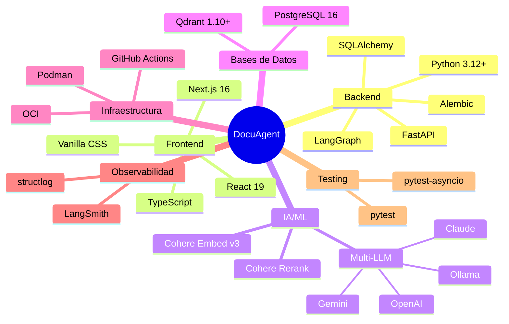

# 🛠️ Stack Tecnológico Detallado

## Resumen Visual

## Stack Completo

### Backend (Python)

| Categoría | Tecnología | Versión | Propósito |
|-----------|-----------|---------|-----------|
| **Runtime** | Python | 3.12+ | Lenguaje principal |
| **API** | FastAPI | ≥0.115 | Framework web async |
| **ASGI** | Uvicorn | ≥0.30 | Servidor ASGI de producción |
| **Orquestación IA** | LangGraph | ≥0.2 | Grafos de estado para RAG |
| **LangChain Core** | langchain-core | ≥0.3 | Abstracciones base |
| **ORM** | SQLAlchemy | ≥2.0 | ORM async para PostgreSQL |
| **Migraciones** | Alembic | ≥1.13 | Migraciones de esquema de BD |
| **Async PG** | asyncpg | ≥0.29 | Driver PostgreSQL async |
| **Validación** | Pydantic | ≥2.9 | Validación y serialización |
| **Config** | pydantic-settings | ≥2.5 | Variables de entorno tipadas |
| **HTTP Client** | httpx | ≥0.27 | Cliente HTTP async |
| **Logging** | structlog | ≥24.0 | Logging estructurado (JSON) |

### Procesamiento de Documentos

| Formato | Librería | Versión | Notas |
|---------|----------|---------|-------|
| **PDF** | PyMuPDF (fitz) | ≥1.24 | Extracción nativa, rápida |
| **Word** | python-docx | ≥1.1 | Preserva estructura |
| **Excel** | openpyxl | ≥3.1 | Lectura de .xlsx |
| **Markdown** | markdown | ≥3.6 | Parsing de .md |
| **HTML cleanup** | beautifulsoup4 | ≥4.12 | Limpieza de tags |
| **CSV** | stdlib csv | built-in | Parsing estándar |
| **JSON** | stdlib json | built-in | Parsing estándar |

### IA / ML

| Componente | Proveedor | Modelo | Dimensiones |
|------------|-----------|--------|-------------|
| **Embeddings** | Cohere | embed-multilingual-v3.0 | 1024 |
| **Reranking** | Cohere | rerank-multilingual-v3.0 | N/A |
| **LLM (activo)** | Google | gemini-2.5-flash | N/A |
| **LLM (fallback)** | OpenAI | gpt-4o-mini | N/A |
| **LLM (fallback)** | Anthropic | claude-4-sonnet | N/A |
| **LLM (local)** | Ollama | llama3.1:8b | N/A |

> Proveedor activo `LLM_PROVIDER=gemini` (`gemini-2.5-flash`); el resto entra por
> la cadena de fallback. Detalle → [`llm-providers.md`](llm-providers.md).

### Frontend (TypeScript)

| Categoría | Tecnología | Versión | Propósito |
|-----------|-----------|---------|-----------|
| **Framework** | Next.js | 16 | App Router, SSR, CSR |
| **UI Library** | React | 19 | Componentes declarativos |
| **Lenguaje** | TypeScript | ≥5.5 | Tipado estático |
| **Estilos** | Vanilla CSS | N/A | CSS Variables, sin framework |
| **Fuentes** | Google Fonts | N/A | Inter + JetBrains Mono |
| **Icons** | Lucide React | ≥0.400 | Iconos SVG |

### Bases de Datos

| BD | Motor | Versión | Propósito |
|----|-------|---------|-----------|
| **Relacional** | PostgreSQL | 16 | Metadatos, logs, sesiones |
| **Vectorial** | Qdrant | ≥1.10 | Embeddings, búsqueda semántica |

### Infraestructura

| Categoría | Tecnología | Propósito |
|-----------|-----------|-----------|
| **Contenedores** | Podman + Podman Compose | Containerización rootless |
| **CI/CD** | GitHub Actions | Build, test, deploy automático |
| **Cloud** | Oracle Cloud Infrastructure | Hosting de producción |
| **Registry** | OCI Container Registry (OCIR) | Almacenamiento de imágenes |
| **Secretos** | OCI Vault | Gestión de API keys |
| **Storage** | OCI Object Storage | Documentos originales |

### Observabilidad

| Categoría | Tecnología | Propósito |
|-----------|-----------|-----------|
| **Tracing** | LangSmith | Trazabilidad del agente |
| **Logging** | structlog | Logs estructurados (JSON) |
| **Métricas** | FastAPI + custom | Health checks, latencia |

### Testing

| Categoría | Tecnología | Propósito |
|-----------|-----------|-----------|
| **Unit/Integration (backend)** | pytest | Tests del backend (en imagen `test` de Podman) |
| **Async** | pytest-asyncio | Tests async |
| **Coverage** | pytest-cov | Cobertura de código |
| **Unit (frontend)** | Vitest | Helper de API (`apiFetch`) |
| **E2E** | Validación manual en staging | Flujo completo con túnel |
| **Linting** | Ruff | Linting + formatting |
| **Type check** | mypy | Verificación de tipos |

> Política: tests/lint **siempre en contenedores**, nunca en local. Detalle →
> [`../development/testing-strategy.md`](../development/testing-strategy.md).

## Justificación de Decisiones Clave

### ¿Por qué LangGraph sobre LangChain simple?
LangGraph ofrece **grafos de estado** que modelan el flujo RAG como nodos con transiciones condicionales, ideal para implementar reranking, validación y fallback como pasos independientes y configurables.

### ¿Por qué Cohere para Embeddings y Rerank?
Cohere tiene el **mejor soporte multilingüe nativo** (ES/EN/PT), con una sola API key para embeddings y reranking. Los modelos `v3` están en el estado del arte para escenarios multilingües.

### ¿Por qué Qdrant sobre pgvector?
Qdrant es **3-5x más rápido** que pgvector para búsquedas vectoriales puras, ofrece payload filtering (filtros sobre metadatos) y tiene un dashboard web para debugging. Se complementa bien con PostgreSQL para datos relacionales.

### ¿Por qué PostgreSQL sobre MongoDB?
Los datos de DocuAgent tienen **relaciones claras** (categoría → documento → chunk → mensaje → feedback), y PostgreSQL con transacciones ACID es superior para logs de auditoría y trazabilidad. Alembic ofrece migraciones versionadas, algo que MongoDB no tiene nativamente.

### ¿Por qué Vanilla CSS sobre TailwindCSS?
- Máximo control sobre el diseño
- Sin dependencia de framework CSS
- CSS Variables para un sistema de diseño coherente
- Mejor rendimiento (sin build step adicional)
