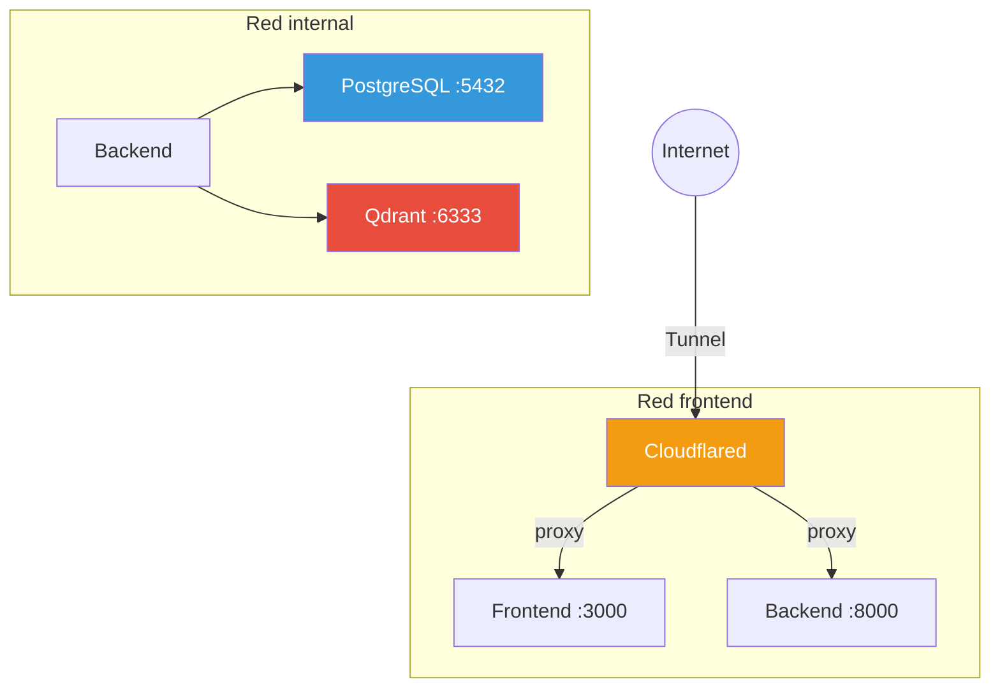

# 🐳 Containerfiles y Compose

## Estructura

```
podman-compose.yml          Base: servicios comunes
podman-compose.dev.yml      Overlay develop: + cloudflared + puertos debug
podman-compose.prod.yml     Overlay producción: sin puertos, health checks
backend/Containerfile       Imagen del backend (Python/FastAPI)
frontend/Containerfile      Imagen del frontend (Next.js)
```

---

## podman-compose.yml (base)

```yaml
version: "3.8"

services:
  backend:
    build:
      context: ./backend
      dockerfile: Containerfile
    container_name: docuagent-backend
    env_file: .env
    ports:
      - "8000:8000"
    depends_on:
      postgres:
        condition: service_healthy
      qdrant:
        condition: service_started
    networks:
      - frontend
      - internal
    restart: unless-stopped

  frontend:
    build:
      context: ./frontend
      dockerfile: Containerfile
    container_name: docuagent-frontend
    env_file: .env
    ports:
      - "3000:3000"
    depends_on:
      - backend
    networks:
      - frontend
    restart: unless-stopped

  postgres:
    image: postgres:16-alpine
    container_name: docuagent-postgres
    environment:
      POSTGRES_USER: ${DB_USER}
      POSTGRES_PASSWORD: ${DB_PASSWORD}
      POSTGRES_DB: ${DB_NAME}
    volumes:
      - pgdata:/var/lib/postgresql/data
    ports:
      - "5432:5432"
    networks:
      - internal
    healthcheck:
      test: ["CMD-SHELL", "pg_isready -U ${DB_USER} -d ${DB_NAME}"]
      interval: 5s
      timeout: 5s
      retries: 5
    restart: unless-stopped

  qdrant:
    image: qdrant/qdrant:v1.10.0
    container_name: docuagent-qdrant
    environment:
      QDRANT__SERVICE__API_KEY: ${QDRANT_API_KEY}
    volumes:
      - qdrant_storage:/qdrant/storage
    ports:
      - "6333:6333"
    networks:
      - internal
    restart: unless-stopped

volumes:
  pgdata:
  qdrant_storage:

networks:
  frontend:
    driver: bridge
  internal:
    driver: bridge
```

---

## podman-compose.dev.yml (develop — agrega tunnel)

```yaml
version: "3.8"

services:
  cloudflared:
    image: cloudflare/cloudflared:latest
    container_name: docuagent-tunnel
    command: tunnel run
    environment:
      TUNNEL_TOKEN: ${CLOUDFLARE_TUNNEL_TOKEN}
    depends_on:
      - frontend
      - backend
    networks:
      - frontend
    restart: unless-stopped
```

---

## podman-compose.prod.yml (producción — sin puertos expuestos)

```yaml
version: "3.8"

services:
  backend:
    image: ${OCIR_REGISTRY}/docuagent-backend:latest
    build: !reset null
    ports: !reset []
    healthcheck:
      test: ["CMD", "curl", "-f", "http://localhost:8000/api/v1/health"]
      interval: 30s
      timeout: 10s
      retries: 3
      start_period: 40s

  frontend:
    image: ${OCIR_REGISTRY}/docuagent-frontend:latest
    build: !reset null
    ports: !reset []

  postgres:
    ports: !reset []

  qdrant:
    ports: !reset []

  cloudflared:
    image: cloudflare/cloudflared:latest
    container_name: docuagent-tunnel-prod
    command: tunnel run
    environment:
      TUNNEL_TOKEN: ${CLOUDFLARE_TUNNEL_TOKEN}
    depends_on:
      - frontend
      - backend
    networks:
      - frontend
    restart: unless-stopped
```

---

## Backend Containerfile

```dockerfile
# backend/Containerfile
FROM python:3.12-slim AS builder

WORKDIR /app
COPY pyproject.toml .
RUN pip install --no-cache-dir --user .

FROM python:3.12-slim

# Usuario no-root
RUN groupadd -r docuagent && useradd -r -g docuagent docuagent

# Copiar dependencias instaladas
COPY --from=builder /root/.local /home/docuagent/.local

# Copiar código
COPY . /app
WORKDIR /app

# Cambiar a usuario no-root
USER docuagent
ENV PATH="/home/docuagent/.local/bin:$PATH"
ENV PYTHONUNBUFFERED=1

EXPOSE 8000

CMD ["uvicorn", "app.main:app", "--host", "0.0.0.0", "--port", "8000"]
```

---

## Frontend Containerfile

```dockerfile
# frontend/Containerfile
FROM node:20-alpine AS builder

WORKDIR /app
COPY package*.json ./
RUN npm ci
COPY . .
RUN npm run build

FROM node:20-alpine

RUN addgroup -S docuagent && adduser -S docuagent -G docuagent

WORKDIR /app
COPY --from=builder /app/.next ./.next
COPY --from=builder /app/public ./public
COPY --from=builder /app/package*.json ./
COPY --from=builder /app/node_modules ./node_modules

USER docuagent

EXPOSE 3000

CMD ["npm", "start"]
```

---

## Red de contenedores



El backend está en **ambas redes**: recibe requests del frontend (red frontend)
y se conecta a las BDs (red internal). PostgreSQL y Qdrant **solo** están en
la red internal, sin acceso desde fuera.
