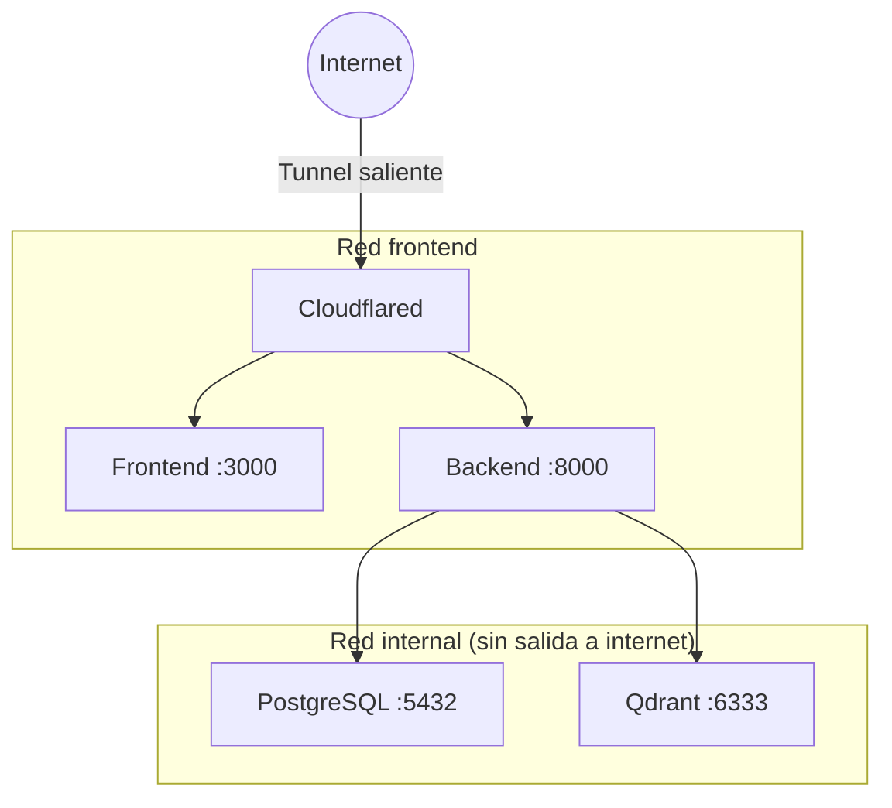

# 🐳 Containerfiles y Compose

Todo corre en contenedores (Podman o Docker). **No se construye ni se prueba en
local** (ver [`development/testing-strategy.md`](../development/testing-strategy.md)).
Los runners en `ops/` envuelven los flags de compose.

## Estructura

```
podman-compose.yml          Base: backend, frontend, postgres, qdrant (+ hardening)
podman-compose.dev.yml      Overlay staging/dev: + cloudflared (túnel)
podman-compose.prod.yml     Overlay prod: imágenes de OCIR, sin puertos, healthcheck, + cloudflared
backend/Containerfile       Imagen backend (multi-stage: builder → test → runtime)
frontend/Containerfile      Imagen frontend (Next.js, multi-stage, no-root)
ops/docuagent.ps1           Runner local (Windows): build + túnel
ops/docuagent.sh            Runner OCI (Ubuntu): pull de OCIR, sin build
```

El archivo de entorno se elige con `ENV_FILE` (`.env`, `.env.staging`,
`.env.prod`). Los runners lo pasan por ti.

---

## podman-compose.yml (base)

Define los 4 servicios y aplica **endurecimiento** a todos:

- `security_opt: [no-new-privileges:true]` + `cap_drop: [ALL]`.
- Límites de recursos: `mem_limit` (backend 1g, qdrant 768m, postgres/frontend
  512m), `cpus: 1.0`, `pids_limit`.
- `restart: unless-stopped`.

Puntos clave por servicio:

```yaml
services:
  backend:
    build: { context: ./backend, dockerfile: Containerfile }
    env_file: ${ENV_FILE:-.env}
    ports: ["8000:8000"]
    volumes:
      - uploads:/app/uploads          # persiste los documentos subidos
    depends_on:
      postgres: { condition: service_healthy }
      qdrant:   { condition: service_started }
    networks: [frontend, internal]
    security_opt: [no-new-privileges:true]
    cap_drop: [ALL]
    mem_limit: 1g
    cpus: 1.0
    pids_limit: 256

  frontend:
    build:
      context: ./frontend
      dockerfile: Containerfile
      args:                            # NEXT_PUBLIC_* se inlinean en BUILD
        NEXT_PUBLIC_API_URL: ${NEXT_PUBLIC_API_URL}
        NEXT_PUBLIC_WS_URL: ${NEXT_PUBLIC_WS_URL}
        NEXT_PUBLIC_APP_NAME: ${NEXT_PUBLIC_APP_NAME}
        NEXT_PUBLIC_TURNSTILE_SITE_KEY: ${NEXT_PUBLIC_TURNSTILE_SITE_KEY}
    env_file: ${ENV_FILE:-.env}
    ports: ["3000:3000"]
    healthcheck:
      test: ["CMD", "wget", "--spider", "-q", "http://localhost:3000"]
      interval: 15s
      timeout: 5s
      retries: 5
    networks: [frontend]

  postgres:                            # postgres:16-alpine, pg_isready healthcheck
    volumes: [pgdata:/var/lib/postgresql/data]
    networks: [internal]

  qdrant:                              # qdrant:v1.10.0, API key obligatoria
    volumes: [qdrant_storage:/qdrant/storage]
    networks: [internal]

volumes: { pgdata, qdrant_storage, uploads }
networks:
  frontend: { driver: bridge }
  internal: { driver: bridge }        # BDs sin acceso externo
```

> **`NEXT_PUBLIC_*` se inlinea en build**: cambiarlas exige **rebuild** de la
> imagen (no basta el `env_file` en runtime). Por eso van como build-args aquí y
> en `deploy.yml`.

---

## podman-compose.dev.yml (staging / develop — añade túnel)

Agrega `cloudflared` (conexión saliente con `CLOUDFLARE_TUNNEL_TOKEN`) para
publicar `dev.angelezequiel.dev` / `api-dev.angelezequiel.dev`. Es el overlay que
levanta `ops/docuagent.ps1 up`.

```yaml
services:
  cloudflared:
    image: cloudflare/cloudflared:latest
    command: tunnel run
    environment: { TUNNEL_TOKEN: ${CLOUDFLARE_TUNNEL_TOKEN} }
    networks: [frontend]
```

---

## podman-compose.prod.yml (producción — OCIR, sin puertos)

- `backend`/`frontend` usan **imágenes de OCIR** (`${OCIR_REGISTRY}/...`) en vez
  de build (`build: !reset null`).
- `ports: !reset []` en todos: nada se expone al host; el tráfico entra por el
  túnel.
- Healthcheck del backend (`curl /api/v1/health`) + `cloudflared`.

Es el overlay que usa `ops/docuagent.sh up` en la VM de OCI.

---

## Backend Containerfile (multi-stage: builder → test → runtime)

```dockerfile
# Etapa 1: builder — instala dependencias de runtime en /install
FROM python:3.12-slim AS builder
RUN apt-get update && apt-get install -y --no-install-recommends build-essential
COPY requirements.txt .
RUN pip install --no-cache-dir --prefix=/install -r requirements.txt

# Etapa 2: test — runtime + ruff/mypy/pytest (para CI y verificación)
#   podman build -f Containerfile --target test -t docuagent-backend-test .
FROM python:3.12-slim AS test
COPY --from=builder /install /usr/local
COPY requirements.txt requirements-dev.txt ./
RUN pip install --no-cache-dir -r requirements-dev.txt
COPY . .
CMD ["pytest"]

# Etapa 3: runtime — imagen final mínima, no-root (target por defecto)
FROM python:3.12-slim AS runtime
RUN apt-get install -y --no-install-recommends curl   # para el healthcheck
COPY --from=builder /install /usr/local
COPY . .
RUN useradd -m -u 1000 docuagent && mkdir -p /app/uploads && chown -R docuagent:docuagent /app
USER docuagent
EXPOSE 8000
# Aplica migraciones y arranca
CMD ["sh", "-c", "alembic upgrade head && uvicorn app.main:app --host 0.0.0.0 --port 8000"]
```

La etapa `test` es la que usan el CI y la verificación local-en-contenedor. La
de `runtime` no trae herramientas de dev.

---

## Frontend Containerfile (Next.js, multi-stage, no-root)

```dockerfile
FROM node:20-alpine AS builder
COPY package*.json ./
RUN npm install
COPY . .
# NEXT_PUBLIC_* como build-args → se inlinean al compilar
ARG NEXT_PUBLIC_API_URL
ARG NEXT_PUBLIC_WS_URL
ARG NEXT_PUBLIC_APP_NAME
ARG NEXT_PUBLIC_TURNSTILE_SITE_KEY
ENV NEXT_PUBLIC_API_URL=$NEXT_PUBLIC_API_URL ... NEXT_TELEMETRY_DISABLED=1
RUN npm run build

FROM node:20-alpine
RUN addgroup -S docuagent && adduser -S docuagent -G docuagent
COPY --from=builder /app/.next ./.next
COPY --from=builder /app/public ./public
COPY --from=builder /app/package*.json ./
COPY --from=builder /app/node_modules ./node_modules
USER docuagent
EXPOSE 3000
CMD ["npm", "start"]
```

---

## Red de contenedores



El backend está en **ambas redes**: recibe del frontend/túnel (red `frontend`) y
habla con las BDs (red `internal`). PostgreSQL y Qdrant **solo** están en
`internal`, sin acceso desde fuera.

---

## Operación (runners)

```powershell
# Local (Windows) — build + túnel
.\ops\docuagent.ps1 up          # con túnel (dev.*)
.\ops\docuagent.ps1 up-local    # solo localhost
.\ops\docuagent.ps1 logs backend
```

```bash
# OCI (Ubuntu) — pull de OCIR, sin build
./ops/docuagent.sh up
./ops/docuagent.sh migrate      # alembic upgrade head
```
