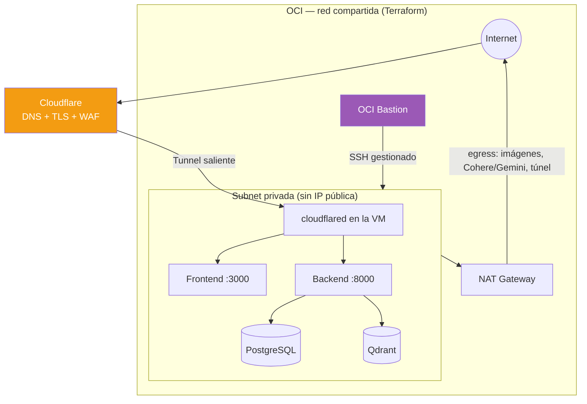

# ☁️ Deploy en OCI

Despliegue de portafolio en **una sola VM** por proyecto, provisionada con
**Terraform** y sin IP pública. El acceso administrativo va por **OCI Bastion**;
el tráfico de la app entra por el **túnel de Cloudflare** (conexión saliente).

> **Estado**: el deploy está automatizado y documentado pero **inactivo** hasta
> crear la instancia (el workflow está gateado por `vars.DEPLOY_ENABLED`).
> Checklist de qué falta → [`oci-go-live.md`](oci-go-live.md).
>
> Infra como código → [`../../infra/terraform/`](../../infra/terraform/) y su
> [README](../../infra/terraform/README.md). Detalle del túnel/dominio (sensible)
> → `docs/private/domain-setup.md`.

## Arquitectura



**Decisiones clave**:

- **Sin IP pública** en las instancias (`prohibit_public_ip_on_vnic = true`).
  No se exponen puertos: la app entra por el túnel (saliente), no por ingress.
- **NAT Gateway** = única salida a internet (pull de OCIR, APIs de Cohere/Gemini,
  el túnel). **Service Gateway** para servicios de OCI sin pasar por internet.
- **OCI Bastion** (servicio gestionado) para entrar por SSH sin IP pública.
- **Red compartida** (1 VCN + subnet + NAT + Bastion) reutilizable por varios
  proyectos; **una instancia por proyecto** (mapa `var.projects`).

## Recursos OCI

| Recurso | Tier | Propósito |
|---------|------|-----------|
| **Compute** (`VM.Standard.A1.Flexible`) | Ampere ARM, Always Free | Una por proyecto (1 OCPU / 6 GB recomendado para un stack RAG) |
| **VCN + subnet privada + NAT + Service GW** | Always Free | Red compartida |
| **OCI Bastion** | Standard | SSH a instancias privadas |
| **Container Registry (OCIR)** | Always Free (500 MB) | Imágenes de backend y frontend |
| **Vault** | — | Secretos en producción |

> **Densidad**: un stack pesado (Postgres + Qdrant + backend LLM) por instancia de
> 1 OCPU / 6 GB. Co-locar un segundo proyecto solo si es ligero.

## 1. Provisionar con Terraform

```bash
cd infra/terraform
cp terraform.tfvars.example terraform.tfvars   # OCIDs, tu IP /32 para el Bastion, SSH key
terraform init
terraform plan
terraform apply
terraform output instances                     # IP privada + OCID por proyecto
```

El `cloud-init` instala `podman`, `podman-compose` y `git`, habilita linger y el
socket de Podman. Las imágenes del proyecto son multi-arch (arm64), así que el
shape Ampere funciona.

## 2. Entrar por Bastion (sin IP pública)

```bash
oci bastion session create-managed-ssh \
  --bastion-id <bastion_id> \
  --target-resource-id <instance_ocid> \
  --target-os-username ubuntu \
  --ssh-public-key-file ~/.ssh/id_ed25519.pub \
  --session-ttl 3600
# `oci bastion session get --session-id <id>` imprime el comando SSH con ProxyCommand.
```

(En la consola de OCI, **Bastion → Sessions** también da el comando listo.)

## 3. Desplegar la app en la VM

```bash
git clone <repo> docuagent && cd docuagent
cp .env.example .env.prod        # rellena: túnel de PROD, claves, COOKIE_DOMAIN, CORS, etc.
./ops/docuagent.sh up            # pull de OCIR + levantar (incluye cloudflared)
./ops/docuagent.sh migrate       # alembic upgrade head (si hace falta)
```

El `cloudflared` del compose levanta el **túnel de producción** (su token va en
`.env.prod`) publicando `docuagent.*` / `api-docuagent.*` hacia esta VM.

## 4. OCIR (registro de imágenes)

Las imágenes las construye y empuja el workflow `deploy.yml` (build → OCIR → SSH).
Login manual si lo necesitas:

```bash
podman login <region>.ocir.io \
  -u "<namespace>/oracleidentitycloudservice/<email>" \
  -p "<auth-token>"
```

## 5. Secretos en producción

Mismos valores que staging (proyecto de portafolio), en `.env.prod` en la VM o en
**OCI Vault**. Rotar las llaves de staging antes de exponer prod. Nunca en git.

## Checklist de deploy

- [ ] `terraform apply` OK (VCN/subnet/NAT/Bastion + instancia)
- [ ] Acceso por Bastion verificado
- [ ] OCIR configurado; secrets/vars de GitHub para `deploy.yml`
- [ ] `vars.DEPLOY_ENABLED` activado
- [ ] `.env.prod` con secretos reales (rotados) + `COOKIE_DOMAIN` + `CORS_ALLOWED_ORIGINS`
- [ ] Túnel de PROD creado y apuntando a los servicios de la VM
- [ ] `./ops/docuagent.sh up` + `migrate` OK
- [ ] `https://api-docuagent.angelezequiel.dev/api/v1/health` responde
- [ ] `https://docuagent.angelezequiel.dev` carga; chat RAG y uploads funcionan
