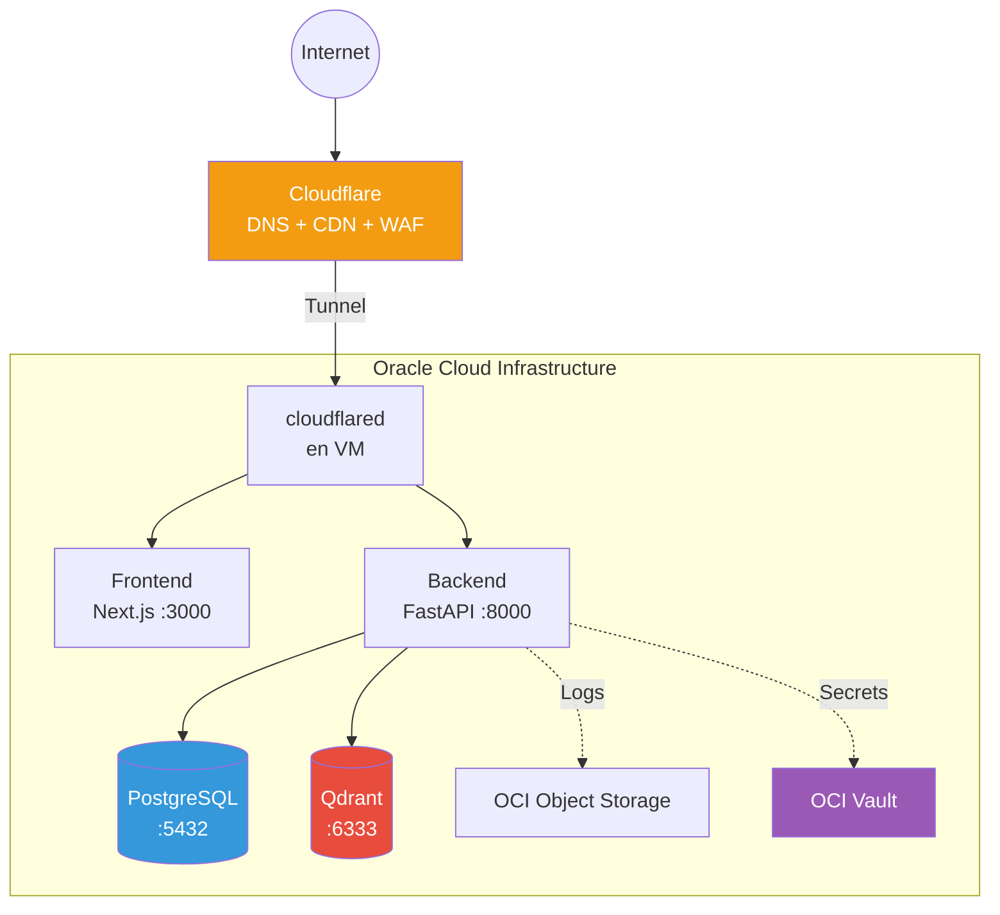

# ☁️ Deploy en OCI

## Arquitectura en OCI



## Recursos OCI Necesarios

| Recurso | Tier | Propósito |
|---------|------|-----------|
| **Compute Instance** | VM.Standard.A1.Flex (ARM, Always Free) | Contenedores (backend, frontend, BDs) |
| **Object Storage** | Standard (Always Free: 20GB) | Documentos originales subidos |
| **Vault** | Default | API keys, DB passwords |
| **Container Registry** | Standard (Always Free: 500MB) | Imágenes de backend y frontend |
| **VCN** | 1 VCN + 2 subnets | Red aislada |

> **Always Free**: OCI ofrece VMs ARM con 4 OCPUs y 24GB RAM gratis para siempre.
> Suficiente para este proyecto.

## Paso a Paso

### 1. Crear VCN

```
Nombre: docuagent-vcn
CIDR: 10.0.0.0/16

Subnet pública:  10.0.1.0/24 (para el tunnel de Cloudflare)
Subnet privada:  10.0.2.0/24 (para BDs — sin acceso directo desde Internet)
```

### 2. Security Lists

**Subnet pública (ingress)**:
- TCP 22 desde tu IP (SSH)
- Todo el tráfico desde 10.0.0.0/16 (comunicación interna)

**Subnet privada (ingress)**:
- TCP 5432 desde 10.0.1.0/24 (PostgreSQL, solo desde subnet pública)
- TCP 6333 desde 10.0.1.0/24 (Qdrant, solo desde subnet pública)

### 3. Crear Compute Instance

```bash
# VM ARM Always Free
Shape: VM.Standard.A1.Flex
OCPUs: 4
RAM: 24 GB
OS: Ubuntu 24.04 (aarch64)
Boot volume: 100 GB
```

### 4. Configurar la VM

```bash
# SSH a la VM
ssh -i ~/.ssh/oci_key ubuntu@<IP_PUBLICA>

# Instalar Podman
sudo apt update && sudo apt install -y podman podman-compose

# Instalar cloudflared
curl -L https://github.com/cloudflare/cloudflared/releases/latest/download/cloudflared-linux-arm64 \
  -o /usr/local/bin/cloudflared
chmod +x /usr/local/bin/cloudflared

# Clonar el proyecto
git clone https://github.com/<tu-usuario>/docuagent.git
cd docuagent

# Configurar .env (con secretos de OCI Vault)
cp .env.example .env
nano .env

# Levantar
./ops/docuagent.sh up
```

### 5. OCI Container Registry (OCIR)

```bash
# Login a OCIR (desde GitHub Actions o local)
podman login <region>.ocir.io/<namespace> \
  -u "<namespace>/oracleidentitycloudservice/<email>" \
  -p "<auth-token>"

# Push manual (normalmente lo hace CI/CD)
podman push <region>.ocir.io/<namespace>/docuagent-backend:latest
podman push <region>.ocir.io/<namespace>/docuagent-frontend:latest
```

### 6. OCI Vault (secretos)

Almacenar en OCI Vault:
- `COHERE_API_KEY`
- `OPENAI_API_KEY` (u otro LLM provider)
- `DB_PASSWORD`
- `QDRANT_API_KEY`
- `LANGCHAIN_API_KEY`
- `CLOUDFLARE_TUNNEL_TOKEN`

### 7. OCI Object Storage (documentos)

```bash
# Crear bucket para documentos originales
oci os bucket create \
  --compartment-id <compartment-id> \
  --name docuagent-documents \
  --storage-tier Standard
```

## Checklist de Deploy

- [ ] VCN + subnets creadas
- [ ] Security lists configuradas (solo puertos necesarios)
- [ ] VM ARM creada y SSH accesible
- [ ] Podman + cloudflared instalados en la VM
- [ ] OCIR configurado, imágenes pusheadas
- [ ] `.env` configurado con secretos reales
- [ ] `./ops/docuagent.sh up` funciona
- [ ] Health check pasa: `curl https://api-agent.tu-dominio.dev/api/v1/health`
- [ ] Frontend accesible: `https://agent.tu-dominio.dev`
- [ ] DNS configurado en Cloudflare
- [ ] OCI Vault con secretos
- [ ] Object Storage bucket creado
- [ ] GitHub Actions con secrets de OCIR
- [ ] CI/CD workflow probado
