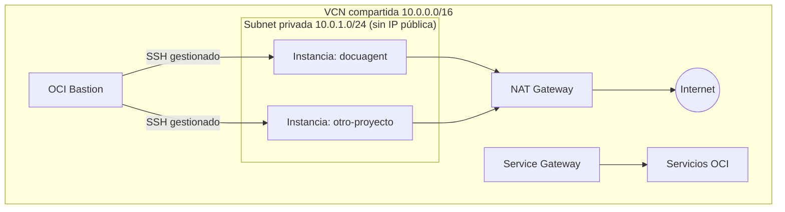

# 🏗️ Infraestructura OCI como código (Terraform)

La infra de OCI se provisiona de forma **reproducible** con Terraform en
[`infra/terraform/`](../../infra/terraform/). Este doc resume el diseño; los
detalles operativos (uso, SSH por Bastion, añadir proyectos) están en el
[README del módulo](../../infra/terraform/README.md).

## Qué crea

```
infra/terraform/
  versions.tf            Terraform ≥1.5, provider oci ≥5.0
  variables.tf           tenancy/region, CIDRs, projects (mapa), SSH key, shape
  network.tf             VCN + subnet privada + NAT + Service GW + route table + security list + Bastion
  compute.tf             una instancia por proyecto (for_each var.projects), ADs, imagen Ubuntu
  cloud-init.yaml        instala podman + podman-compose + git, linger, socket
  outputs.tf             vcn_id, private_subnet_id, bastion_id, instances{private_ip, id}
  terraform.tfvars.example
```

## Diseño

- **Red COMPARTIDA** (una vez): VCN `10.0.0.0/16`, **subnet privada**
  `10.0.1.0/24` con `prohibit_public_ip_on_vnic = true`, **NAT Gateway** (egress),
  **Service Gateway** (servicios OCI sin internet), route table y security list.
- **Instancias privadas** (`var.projects`, una por proyecto): **sin IP pública**,
  shape `VM.Standard.A1.Flexible` (Ampere ARM, Always Free), plugin de Bastion
  habilitado.
- **OCI Bastion** (servicio gestionado) para SSH a las instancias sin IP pública;
  `bastion_client_cidrs` restringe quién puede abrir sesiones (tu IP `/32`).



## Por qué sin IP pública

La app **no expone puertos**: el tráfico entrante lo da el **túnel de Cloudflare**
(`cloudflared` hace una conexión *saliente*). La salida a internet (pull de OCIR,
APIs de Cohere/Gemini, el túnel) va por el **NAT**. El acceso administrativo va
por el **Bastion**. Resultado: superficie de ataque mínima, cero ingress público.

## Escalar a más proyectos

La red es compartida. Para un proyecto nuevo basta agregar una entrada al mapa y
`terraform apply` — crea otra instancia privada en la misma red, accesible por el
mismo Bastion:

```hcl
projects = {
  docuagent     = { ocpus = 1, memory_gbs = 6, boot_gbs = 50 }
  otro-proyecto = { ocpus = 1, memory_gbs = 6, boot_gbs = 50 }
}
```

> **Densidad**: un stack RAG pesado (Postgres + Qdrant + backend LLM) por instancia
> de 1 OCPU / 6 GB. Co-loca un segundo proyecto en la misma VM solo si es ligero.

## Flujo completo

1. `terraform apply` (esta infra).
2. Entrar por Bastion → la VM ya trae Podman + git (cloud-init).
3. `git clone` + `.env.prod` + `./ops/docuagent.sh up`.

Pasos detallados y deploy de la app → [`oci-setup.md`](oci-setup.md). Checklist de
go-live → [`oci-go-live.md`](oci-go-live.md).

## Notas de seguridad / git

- `terraform.tfvars` (OCIDs, IP, SSH) y `*.tfstate` (puede contener datos
  sensibles) **no se commitean** (ya están en `.gitignore`). El `.terraform.lock.hcl`
  sí se versiona para fijar versiones de provider.
- Las credenciales de API de OCI viven en `~/.oci/config`, fuera del repo.
