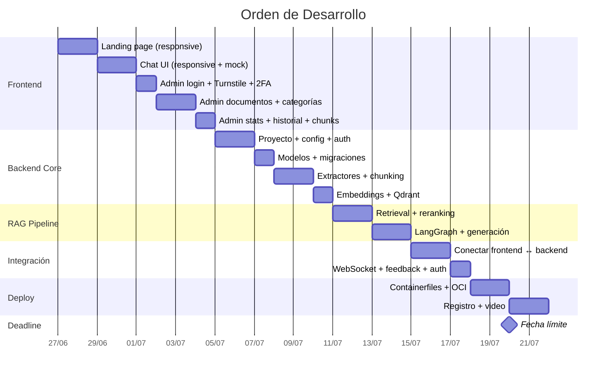

# 🗺️ Guía de Desarrollo — Orden de Ejecución

## Decisiones Clave

### Páginas de la aplicación

| Página | Ruta | Acceso | Propósito |
|--------|------|--------|-----------|
| **Landing** | `/` | Público | Presentación del proyecto |
| **Chat** | `/chat` | Público | Interfaz conversacional para colaboradores |
| **Login** | `/admin/login` | Público | Autenticación del administrador |
| **Dashboard** | `/admin` | Protegido | Vista general, stats de feedback |
| **Documentos** | `/admin/documents` | Protegido | Subir, listar, eliminar, re-indexar |
| **Categorías** | `/admin/categories` | Protegido | CRUD de categorías dinámicas |
| **Chunks** | `/admin/documents/:id/chunks` | Protegido | Ver chunks indexados de un documento |
| **Historial** | `/admin/history` | Protegido | Historial de consultas del chat |

### Autenticación del Admin

```
Login → Email/Password → Cloudflare Turnstile (anti-bot)
     → TOTP 2FA (Google Authenticator)
     → JWT access token + refresh token
     → Rutas /admin/* protegidas por middleware
```

| Capa | Tecnología |
|------|-----------|
| Anti-bot | Cloudflare Turnstile (en login) |
| Credenciales | Email + password (bcrypt hash) |
| 2FA | TOTP compatible con Google Authenticator (pyotp) |
| Tokens | JWT (access 15min + refresh 7d) |
| Storage | HttpOnly cookies (refresh) + memory (access) |
| Middleware | Next.js middleware para proteger `/admin/*` |

> **Sin registro público.** El admin se crea vía script CLI o seed de BD.
> Solo existe un admin (o pocos, creados manualmente).

### Flujo de los documentos

```
Admin sube documentos vía /admin/documents
     ↓
Extracción + chunking + embeddings
     ↓
Indexación en Qdrant + metadatos en PostgreSQL
     ↓
Colaboradores preguntan en /chat → agente busca en docs indexados
```

Los documentos son de una empresa ficticia (generados con IA).
También se pueden cargar vía scripts CLI o API directa.

### Identidad Visual y Nombre del Proyecto

* **Nombre Oficial:** **DocuAgent** (descriptivo de Documentos + Inteligencia Artificial/Agente RAG).
* **Temas Admitidos:** Soporte completo para **Tema Claro (Light Mode)** y **Tema Oscuro (Dark Mode)**. La interfaz web contará con un interruptor/selector (toggle) en el encabezado o barra de navegación para alternar de forma fluida y en caliente entre ambos temas, persistiendo la preferencia del usuario en localStorage.
* **Paleta de Colores:** Se deben evitar colores tipo neón o excesivamente intensos. En su lugar, se implementará una paleta de colores cálidos y suaves a la vista (por ejemplo: ámbar suave, terracota, bronce y verde oliva silenciado, combinados con fondos de carbón cálido en modo oscuro y crema o arena suave en modo claro) para lograr una apariencia premium, acogedora y confortable para lecturas prolongadas.
* **Uso de Iconos vs. Emojis:** Queda estrictamente prohibido el uso de emojis en la interfaz gráfica de la aplicación (botones, menús, cabeceras, tarjetas, etc.). En su lugar, se utilizarán exclusivamente iconos vectoriales (como la biblioteca `lucide-react` o SVGs personalizados inline) para asegurar un aspecto profesional, consistente y limpio.

### Responsividad

**TODO el frontend es 100% responsive.** Desktop, tablet y móvil.
Diseño mobile-first. No es opcional — es requisito base.

---

## Orden de Desarrollo

### Principio: Frontend First

Se desarrolla el **frontend primero** con datos mockeados, luego el backend
para reemplazar mocks con datos reales.



---

## Fase 1: Frontend — Landing Page (2 días)

**Meta**: Página de presentación premium, responsive, que impresione.

### Tareas
- [x] Inicializar proyecto Next.js 15 (App Router, TypeScript)
- [x] Configurar CSS global (variables de diseño, soporte completo para temas claro y oscuro con persistencia, fonts Inter + JetBrains Mono)
- [x] Hero section con título, subtítulo y CTA → `/chat`
- [x] Sección "Características" (multi-formato, multilingüe, citación de fuentes)
- [x] Sección "Cómo funciona" (diagrama visual del pipeline)
- [x] Sección "Tech Stack" (logos/badges de las tecnologías)
- [x] Footer con créditos (Alura LATAM)
- [x] Responsive: mobile, tablet, desktop (mobile-first)
- [x] Animaciones suaves (scroll reveal, hover effects)
- [x] SEO: meta tags, Open Graph, title
- [x] Navbar con links: Inicio · Chat · Admin e interruptor (toggle) para alternar temas (Claro/Oscuro)

---

## Fase 2: Frontend — Chat UI (2 días)

**Meta**: Interfaz de chat conversacional funcional con datos mock.

### Tareas
- [ ] Layout del chat: sidebar (sesiones) + área de mensajes + input
- [ ] Componente de mensaje: usuario vs asistente (avatar, markdown rendering)
- [ ] Componente de fuentes citadas (colapsable, archivo + sección + página)
- [ ] Botones de feedback (👍/👎) por mensaje
- [ ] Indicador de "escribiendo..." (skeleton/dots animation)
- [ ] Input con botón de enviar + Enter para enviar
- [ ] Mock de datos: respuestas predefinidas con fuentes ficticias
- [ ] Responsive: sidebar se colapsa como drawer en móvil
- [ ] Estado vacío: bienvenida con sugerencias de preguntas
- [ ] Badge "Agente de IA" en header o mensajes

---

## Fase 3: Frontend — Admin Login + 2FA (1 día)

**Meta**: Login protegido con Turnstile y TOTP.

### Tareas
- [ ] Página `/admin/login` con formulario email + password
- [ ] Integrar Cloudflare Turnstile (widget anti-bot)
- [ ] Paso 2: input de código TOTP (6 dígitos, Google Authenticator)
- [ ] Pantalla de setup 2FA (QR code para primer setup — mock)
- [ ] Manejo de tokens JWT (access en memory, refresh en HttpOnly cookie)
- [ ] Next.js middleware: redirect a login si no autenticado en `/admin/*`
- [ ] Responsive: login se ve bien en móvil
- [ ] Feedback visual: errores de credenciales, Turnstile, TOTP

### Flujo del Login
```
1. Email + Password + Turnstile challenge
2. Si credenciales OK → pedir código TOTP (6 dígitos)
3. Si TOTP OK → JWT access + refresh → redirect /admin
4. Si falla → error + rate limit (máx 5 intentos / 15 min)
```

---

## Fase 4: Frontend — Admin Panel (2 días)

**Meta**: CRUD de documentos y categorías con datos mock.

### Tareas
- [ ] Layout admin: sidebar con nav (Dashboard · Documentos · Categorías · Historial)
- [ ] Dashboard (`/admin`): cards con stats (total docs, chunks, feedback %, queries)
- [ ] Documentos (`/admin/documents`):
  - [ ] Upload drag & drop (multi-archivo)
  - [ ] Selector de categoría al subir
  - [ ] Tabla de documentos (nombre, categoría, estado, fecha, acciones)
  - [ ] Estado: badges de color (pendiente · procesando · indexado · error)
  - [ ] Acciones: re-indexar, ver chunks, eliminar
  - [ ] Responsive: tabla se adapta a móvil (cards en vez de tabla)
- [ ] Categorías (`/admin/categories`):
  - [ ] Lista de categorías con color, icono, conteo de docs
  - [ ] Modal crear/editar (nombre, slug, color, icono)
  - [ ] Eliminar con confirmación
- [ ] Datos mock para todo (se reemplazan al integrar)

---

## Fase 5: Frontend — Stats, Historial y Chunks (1 día)

**Meta**: Dashboards informativos para el admin.

### Tareas
- [ ] Feedback stats: gráfico de % positivo/negativo, preguntas con peor feedback
- [ ] Historial de consultas (`/admin/history`):
  - [ ] Tabla: pregunta, respuesta (truncada), fuentes, confianza, fecha
  - [ ] Filtros: fecha, categoría, fallback/no-fallback
  - [ ] Click para expandir y ver la respuesta completa
- [ ] Chunks viewer (`/admin/documents/:id/chunks`):
  - [ ] Lista de chunks de un documento
  - [ ] Contenido del chunk, índice, sección, metadatos
- [ ] Responsive en todas las vistas

---

## Fase 6: Backend — Setup + Auth + Modelos (2 días)

**Meta**: Backend funcional con auth y BD configurada.

### Tareas
- [ ] Inicializar `backend/` con `pyproject.toml`
- [ ] Estructura FastAPI: main.py, routers, middleware
- [ ] Config pydantic-settings (`.env`)
- [ ] Conexión PostgreSQL (asyncpg + SQLAlchemy async)
- [ ] Modelos: admin_users, categories, documents, chunks, sessions, messages, feedback
- [ ] Alembic: primera migración
- [ ] Auth: registro de admin vía CLI (`python -m app.scripts.create_admin`)
- [ ] Auth: login endpoint con bcrypt + Turnstile verification + TOTP (pyotp)
- [ ] Auth: JWT access (15min) + refresh (7d) + middleware de protección
- [ ] Auth: setup 2FA (generar secret + QR provisioning URI)
- [ ] Health endpoints
- [ ] Seed de categorías iniciales
- [ ] Script para crear admin: `python -m app.scripts.create_admin --email admin@empresa.com`

---

## Fase 7: Backend — Pipeline de Ingesta (2 días)

**Meta**: Subir un documento y que aparezca indexado en Qdrant.

### Tareas
- [ ] Extractores: PDF, Word, Excel, PowerPoint, Markdown, CSV, JSON, HTML, TXT
- [ ] Limpieza de texto
- [ ] Chunking semántico (SemanticChunker + Cohere)
- [ ] Embeddings (Cohere Embed v3 multilingual)
- [ ] Vector store (Qdrant: colección, indexación, payload indexes)
- [ ] Registrar chunks en PostgreSQL
- [ ] Endpoint `POST /documents` (upload multipart, requiere auth)
- [ ] Endpoints CRUD: `GET/DELETE /documents`, `POST /documents/:id/reindex`
- [ ] Endpoints CRUD: categorías
- [ ] Endpoint `GET /documents/:id/chunks`
- [ ] Script CLI: `python -m app.scripts.ingest --dir ./documents/`
- [ ] Generar documentos ficticios de la empresa (con IA)

### Documentos ficticios
```
documents/
  rh/                         politica_vacaciones.pdf, manual_onboarding.docx, beneficios.md
  legal/                      politica_privacidad.pdf, terminos_servicio.md
  financiero/                 politica_gastos.pdf, reembolsos.xlsx
  operaciones/                manual_procesos.pdf, guia_sistemas.md
  comunicacion/               comunicado_general.md, minuta_reunion.docx
```

---

## Fase 8: Backend — Pipeline RAG (2 días)

**Meta**: Preguntar algo y recibir una respuesta con fuentes.

### Tareas
- [ ] Query analyzer (detectar categoría, idioma)
- [ ] Retriever (embedding query + Qdrant top 20)
- [ ] Reranker (Cohere Rerank → top 5)
- [ ] Context builder + Generator + Validator
- [ ] LangGraph: grafo completo
- [ ] Anti-alucinación + fallback multilingüe
- [ ] Input sanitizer (prompt injection)
- [ ] `POST /chat` (sync) + `WS /chat/ws` (streaming)
- [ ] Sesiones + historial en PostgreSQL
- [ ] Feedback endpoint (`POST /feedback`)
- [ ] Stats endpoint (`GET /admin/stats`)
- [ ] History endpoint (`GET /admin/history`)

---

## Fase 9: Integración Frontend ↔ Backend (3 días)

**Meta**: Reemplazar todos los mocks por datos reales.

### Tareas
- [ ] Conectar login real (Turnstile + TOTP + JWT)
- [ ] Setup 2FA real (QR code generado por backend)
- [ ] Conectar chat con `POST /chat` y luego WebSocket streaming
- [ ] Fuentes reales del pipeline RAG
- [ ] Feedback real (👍/👎 → PostgreSQL)
- [ ] Admin: CRUD documentos real (upload + estado + re-indexar)
- [ ] Admin: CRUD categorías real
- [ ] Admin: stats de feedback reales
- [ ] Admin: historial de consultas real
- [ ] Admin: chunks viewer real
- [ ] Tests E2E

---

## Fase 10: Deploy en OCI + Registro (4 días)

**Meta**: DocuAgent accesible en `docuagent.angelezequiel.dev` + evidencia.

### Tareas
- [ ] Containerfiles finales (backend + frontend)
- [ ] podman-compose + overlay prod
- [ ] VM en OCI (ARM Always Free)
- [ ] Cloudflare Tunnel → OCI
- [ ] Subir documentos ficticios a producción
- [ ] Verificar todo funciona (chat, admin, auth, 2FA)
- [ ] GitHub Actions CI/CD
- [ ] DNS configurado
- [ ] Screenshot del agente en OCI
- [ ] Video demostrativo del flujo completo
- [ ] Actualizar README con imagen/video
- [ ] Revisión final de código y docs
