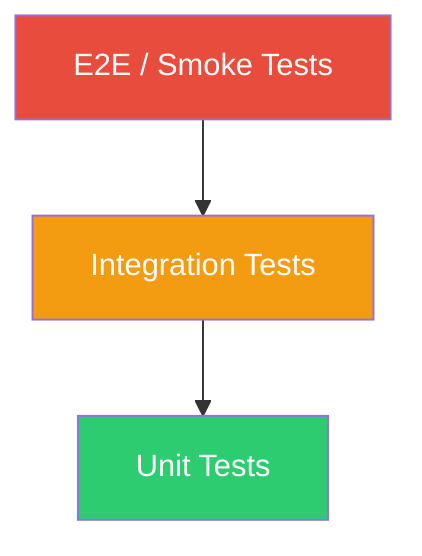

# 🧪 Estrategia de Testing

## Capas de Tests



| Capa | Qué prueba | Herramienta | Dónde |
|------|-----------|-------------|-------|
| **Unit** | Funciones aisladas, lógica pura | pytest | `tests/unit/` |
| **Integration** | Servicios con BDs reales | pytest + testcontainers | `tests/integration/` |
| **E2E** | Flujo completo via API | scripts custom | `tests/e2e/` |

---

## Unit Tests

Prueban lógica pura sin dependencias externas (BDs, APIs). Mocks para todo lo externo.

```
tests/unit/
  test_extractors.py        # Cada extractor (PDF, Word, etc.)
  test_chunker.py           # Chunking: tamaños, overlap, edge cases
  test_cleaner.py           # Limpieza de texto
  test_input_sanitizer.py   # Prompt injection patterns
  test_response_validator.py # Anti-alucinación
  test_llm_factory.py       # Factory devuelve el proveedor correcto
  test_schemas.py           # Pydantic: validación, serialización
```

### Ejemplo

```python
# tests/unit/test_chunker.py
import pytest
from app.ingestion.chunker import ChunkingConfig, split_by_sections

def test_chunk_respeta_max_size():
    config = ChunkingConfig(max_chunk_size=500)
    text = "Lorem ipsum " * 200  # Texto largo
    chunks = split_by_sections(text, config)
    assert all(len(c.content) <= 500 for c in chunks)

def test_chunk_fusiona_bajo_min_size():
    config = ChunkingConfig(min_chunk_size=200)
    text = "Párrafo corto."  # Muy pequeño
    chunks = split_by_sections(text, config)
    # No debería crear un chunk de < 200 chars solo
    assert len(chunks) <= 1
```

### Ejecutar

```bash
pytest tests/unit/ -v
pytest tests/unit/ -v -k "test_chunker"  # Solo chunker
pytest tests/unit/ --cov=app --cov-report=html  # Con coverage
```

---

## Integration Tests

Prueban interacción real con PostgreSQL y Qdrant (contenedores de test).

```
tests/integration/
  conftest.py               # Fixtures: db_session, qdrant_client, embedding_service
  test_document_service.py  # Upload → extracción → chunks en BD
  test_vector_store.py      # Indexar → buscar → verificar resultados
  test_retrieval.py         # Query → search → rerank → contexto
  test_chat_service.py      # Sesión → pregunta → respuesta con fuentes
  test_semantic_search.py   # Similitud multilingüe (ES/EN/PT)
```

### Fixtures compartidas

```python
# tests/integration/conftest.py
import pytest_asyncio
from sqlalchemy.ext.asyncio import create_async_engine, AsyncSession

@pytest_asyncio.fixture
async def db_session():
    """Sesión de BD de test (PostgreSQL real en contenedor)."""
    engine = create_async_engine(settings.test_database_url)
    async with engine.begin() as conn:
        await conn.run_sync(Base.metadata.create_all)
    async with AsyncSession(engine) as session:
        yield session
    async with engine.begin() as conn:
        await conn.run_sync(Base.metadata.drop_all)

@pytest_asyncio.fixture
async def qdrant_client():
    """Cliente Qdrant apuntando al contenedor de test."""
    client = QdrantClient(host="localhost", port=6333)
    client.recreate_collection(
        collection_name="test_documents",
        vectors_config=models.VectorParams(size=1024, distance=models.Distance.COSINE),
    )
    yield client
    client.delete_collection("test_documents")
```

### Ejecutar

```bash
# Requiere PostgreSQL y Qdrant corriendo
podman-compose up -d postgres qdrant
pytest tests/integration/ -v
```

---

## E2E Tests

Prueban el flujo completo vía HTTP contra el servidor levantado.

```
tests/e2e/
  test_full_pipeline.py     # Upload → indexar → preguntar → respuesta con fuentes
  test_category_crud.py     # CRUD completo de categorías
  test_health.py            # Health checks pasan
```

### Flujo del E2E principal

```python
# tests/e2e/test_full_pipeline.py
"""
Flujo completo:
1. Crear categoría "Testing"
2. Subir documento de prueba (Markdown)
3. Esperar indexación
4. Preguntar algo que está en el documento
5. Verificar que la respuesta cita la fuente correcta
6. Enviar feedback positivo
7. Verificar feedback en stats
8. Eliminar documento
9. Verificar que el documento ya no aparece en búsquedas
"""
```

### Ejecutar

```bash
# Requiere el stack completo corriendo
.\ops\docuagent.ps1 up-local
pytest tests/e2e/ -v --timeout=60
```

---

## Documentos de Prueba

Documentos de ejemplo para testing en `tests/fixtures/documents/`:

```
tests/fixtures/documents/
  politica_vacaciones.md        # ES - Texto estructurado con secciones
  employee_handbook.md          # EN - Manual en inglés
  politica_ferias.md            # PT - Política en portugués
  datos_financieros.xlsx        # Excel con tablas
  procedimiento_onboarding.pdf  # PDF con varias páginas
  config_ejemplo.json           # JSON estructurado
  datos_empleados.csv           # CSV con filas
  README_proyecto.md            # Markdown con headers
```

Estos documentos contienen contenido predecible para que los tests puedan
verificar que las respuestas son correctas.

---

## Coverage

Objetivo mínimo: **80% en unit tests**, **60% en integration**.

```bash
# Generar reporte HTML
pytest tests/ --cov=app --cov-report=html --cov-report=term-missing

# Ver reporte
start htmlcov/index.html
```

---

## CI (GitHub Actions)

Los tests corren automáticamente en cada push/PR:

```yaml
# .github/workflows/ci.yml
- pytest tests/unit/ -v
- ruff check app/
- mypy app/
# Integration tests corren con services (postgres + qdrant)
- pytest tests/integration/ -v
```
