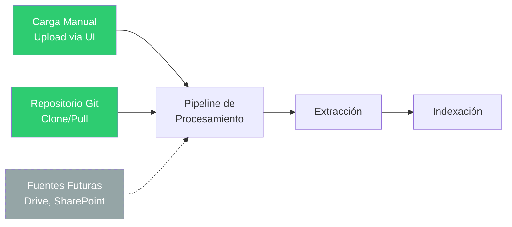
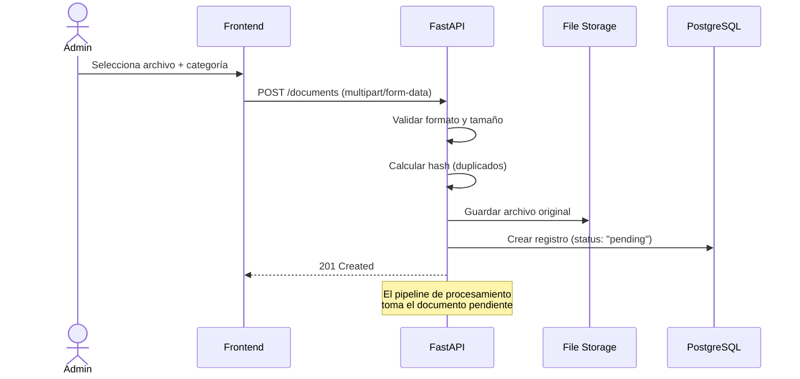

# 📥 Fase 1: Colecta y Organización de Documentos

## Resumen

Esta fase establece las bases organizacionales del proyecto: qué documentos ingresan al sistema, cómo se categorizan, quién los mantiene y cómo llegan al pipeline de procesamiento.

> **Principio clave**: "Garbage in, garbage out" — La calidad de las respuestas del agente depende directamente de la calidad de los documentos que alimentan la base.

## 1. Mapeo de Fuentes

### Fuentes configuradas para el MVP

| Fuente | Tipo | Prioridad | Estado |
|--------|------|-----------|--------|
| **Carga manual** (upload) | Archivos locales | Alta | MVP |
| **Repositorios Git** | Documentación técnica (.md) | Alta | MVP |
| Google Drive | Carpetas compartidas | Futura | Planificada |
| SharePoint/OneDrive | Carpetas corporativas | Futura | Planificada |

### Flujo de Ingesta



## 2. Sistema de Categorías Dinámicas

Las categorías son **configurables desde la interfaz** y se almacenan en PostgreSQL. No están hardcodeadas en el código.

### Categorías Sugeridas de Inicio

| Categoría | Slug | Color | Descripción |
|-----------|------|-------|-------------|
| Recursos Humanos | `rh` | #3498db | Políticas de RH, beneficios, vacaciones |
| Financiero | `financiero` | #2ecc71 | Procedimientos financieros, reembolsos |
| Legal / Jurídico | `legal` | #e74c3c | Contratos, compliance, normativas |
| Operaciones | `operaciones` | #f39c12 | Procedimientos operacionales |
| TI / Tecnología | `ti` | #9b59b6 | Documentación técnica, guías |
| Compliance | `compliance` | #e67e22 | Normativas, auditoría |
| General | `general` | #7f8c8d | Documentos que no encajan en otra categoría |

### API de Categorías

```
POST   /api/v1/categories          → Crear categoría
GET    /api/v1/categories          → Listar categorías
GET    /api/v1/categories/:id      → Obtener categoría
PUT    /api/v1/categories/:id      → Actualizar categoría
DELETE /api/v1/categories/:id      → Eliminar categoría (soft delete)
```

## 3. Curaduría de Calidad

### Criterios de Aceptación de Documentos

| Criterio | Descripción | Acción |
|----------|-------------|--------|
| **Versión vigente** | Solo la versión oficial y actualizada | Rechazar versiones antiguas |
| **No duplicado** | No exista otro documento con el mismo contenido | Detectar duplicados por hash |
| **Contenido relevante** | Debe contener información útil para consultas | Rechazar notas personales, drafts |
| **Formato soportado** | PDF, DOCX, XLSX, MD, CSV, JSON, TXT | Rechazar formatos no soportados |
| **Tamaño razonable** | Límite configurable (ej: 50MB) | Informar al usuario |

### Detección de Duplicados

```python
# Verificar duplicados por hash SHA-256 del archivo
import hashlib

def compute_file_hash(file_content: bytes) -> str:
    return hashlib.sha256(file_content).hexdigest()
```

## 4. Definición de Responsables (Ownership)

El sistema de ownership se implementa a nivel de categoría:

| Campo | Descripción |
|-------|-------------|
| `category.name` | Nombre de la categoría |
| `category.description` | Descripción de los documentos que contiene |
| `document.uploaded_by` | Quién cargó el documento (futuro: con auth) |

> **Nota**: En el MVP (sin autenticación), el ownership se gestiona organizacionalmente. La persona de cada área es responsable de cargar y mantener los documentos de su categoría.

## 5. Acceso y Permisos

- **Acceso libre**: Todos los colaboradores pueden consultar cualquier documento
- **Sin autenticación** en el MVP (acceso dentro de la red corporativa)
- **Acceso de lectura**: El agente necesita acceso a los archivos cargados (almacenados en `uploads/` o en OCI Object Storage)

## 6. Proceso de Ingesta Inicial

### Opción A: Carga Manual (MVP)



### Opción B: Integración con Git (MVP)

```bash
# Script para ingestar documentación desde un repo Git
python scripts/ingest_git_repo.py \
  --repo-url https://github.com/org/docs.git \
  --category "ti" \
  --file-patterns "*.md" "*.txt"
```

## 7. Esquema de Metadatos por Documento

Cada documento que ingresa al sistema se registra con los siguientes metadatos:

```json
{
  "id": "uuid",
  "category_id": "uuid",
  "original_filename": "politica_vacaciones_2024.pdf",
  "filename": "abc123_politica_vacaciones_2024.pdf",
  "file_path": "/uploads/rh/abc123_politica_vacaciones_2024.pdf",
  "mime_type": "application/pdf",
  "file_size": 245760,
  "file_hash": "sha256:a1b2c3...",
  "status": "pending",
  "language": null,
  "chunk_count": null,
  "metadata": {
    "author": "María García",
    "version": "2.1",
    "document_date": "2024-01-15",
    "custom_fields": {}
  },
  "created_at": "2026-06-27T10:00:00Z",
  "updated_at": "2026-06-27T10:00:00Z",
  "indexed_at": null
}
```

## 8. Estructura de Almacenamiento

```
uploads/                          # Raíz de almacenamiento
├── rh/                           # Por categoría (slug)
│   ├── abc123_politica_vacaciones.pdf
│   └── def456_manual_onboarding.docx
├── financiero/
│   └── ghi789_procedimiento_reembolso.pdf
├── legal/
│   └── jkl012_contrato_tipo_2024.docx
└── ti/
    ├── mno345_guia_deploy.md
    └── pqr678_arquitectura_sistema.md
```
