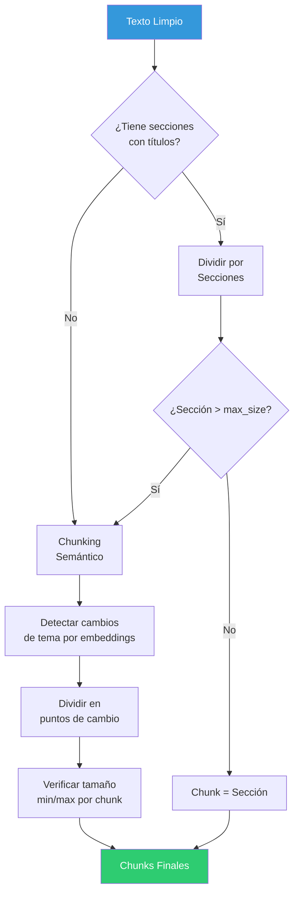

# ⚙️ Fase 2: Procesamiento y Extracción de Contenido

## Resumen

Transforma documentos originales (PDF, Word, Excel, etc.) en texto limpio y estructurado, dividido en chunks con metadatos, listo para la indexación vectorial.


## 1. Extracción por Formato

### Extractores Implementados

| Formato | Extensión | Librería | Notas |
|---------|-----------|----------|-------|
| PDF (nativo) | `.pdf` | PyMuPDF (fitz) | Texto directo, preserva estructura de páginas |
| Word | `.docx` | python-docx | Preserva títulos, párrafos, listas |
| Excel | `.xlsx` | openpyxl | Convierte tablas en texto estructurado |
| Markdown | `.md` | markdown + bs4 | Elimina sintaxis, preserva contenido |
| CSV | `.csv` | csv (stdlib) | Convierte filas en texto con headers |
| JSON | `.json` | json (stdlib) | Aplanamiento de estructura jerárquica |
| Texto plano | `.txt` | built-in | Lectura directa |

### Interfaz del Extractor

```python
from abc import ABC, abstractmethod
from dataclasses import dataclass

@dataclass
class ExtractedContent:
    text: str                      # Texto completo extraído
    pages: list[str] | None        # Texto por página (si aplica)
    sections: list[dict] | None    # Secciones con título (si aplica)
    language: str | None           # Idioma detectado
    metadata: dict                 # Metadatos extraídos del archivo

class BaseExtractor(ABC):
    supported_mimetypes: list[str]

    @abstractmethod
    async def extract(self, file_path: str) -> ExtractedContent:
        ...
```

### Detalle por Extractor

#### PDF (`PyMuPDF`)
```python
# Extracción página por página, preservando estructura
import fitz

async def extract_pdf(file_path: str) -> ExtractedContent:
    doc = fitz.open(file_path)
    pages = []
    for page in doc:
        text = page.get_text("text")  # Texto nativo
        pages.append(text)
    return ExtractedContent(
        text="\n\n".join(pages),
        pages=pages,
        metadata={"page_count": len(pages), "author": doc.metadata.get("author")}
    )
```

#### Word (`python-docx`)
```python
# Preservar estructura de títulos y párrafos
from docx import Document

async def extract_docx(file_path: str) -> ExtractedContent:
    doc = Document(file_path)
    sections = []
    current_section = {"title": "", "content": []}

    for para in doc.paragraphs:
        if para.style.name.startswith("Heading"):
            if current_section["content"]:
                sections.append(current_section)
            current_section = {"title": para.text, "content": []}
        else:
            current_section["content"].append(para.text)

    return ExtractedContent(text=full_text, sections=sections, ...)
```

#### Excel (`openpyxl`)
```python
# Convertir cada fila en texto con headers repetidos
# Ej: "Empleado: Juan | Departamento: Ventas | Salario: 50000"
async def extract_xlsx(file_path: str) -> ExtractedContent:
    wb = openpyxl.load_workbook(file_path)
    texts = []
    for sheet in wb.sheetnames:
        ws = wb[sheet]
        headers = [cell.value for cell in ws[1]]
        for row in ws.iter_rows(min_row=2, values_only=True):
            row_text = " | ".join(
                f"{h}: {v}" for h, v in zip(headers, row) if v
            )
            texts.append(row_text)
    return ExtractedContent(text="\n".join(texts), ...)
```

## 2. Limpieza de Texto

### Operaciones de Limpieza

| Operación | Descripción | Ejemplo |
|-----------|-------------|---------|
| **Espacios duplicados** | Colapsar múltiples espacios | `"hola    mundo"` → `"hola mundo"` |
| **Líneas vacías** | Eliminar líneas vacías excesivas | 5+ líneas vacías → 2 |
| **Headers/Footers** | Eliminar encabezados/pies repetidos | "Página X de Y", "Confidencial" |
| **Caracteres especiales** | Eliminar caracteres de control/formato | `\x00`, `\xad`, etc. |
| **Unicode normalización** | Normalizar caracteres Unicode | NFC normalization |
| **URLs y emails** | Mantener pero no indexar como significado | Preservar para referencia |

```python
# cleaner.py
import re
import unicodedata

class TextCleaner:
    def clean(self, text: str) -> str:
        text = self._normalize_unicode(text)
        text = self._remove_control_chars(text)
        text = self._collapse_whitespace(text)
        text = self._remove_excessive_newlines(text)
        text = self._strip_headers_footers(text)
        return text.strip()

    def _normalize_unicode(self, text: str) -> str:
        return unicodedata.normalize("NFC", text)

    def _collapse_whitespace(self, text: str) -> str:
        return re.sub(r"[^\S\n]+", " ", text)

    def _remove_excessive_newlines(self, text: str) -> str:
        return re.sub(r"\n{4,}", "\n\n\n", text)

    def _remove_control_chars(self, text: str) -> str:
        return re.sub(r"[\x00-\x08\x0b\x0c\x0e-\x1f\x7f-\x9f]", "", text)

    def _strip_headers_footers(self, text: str) -> str:
        # Eliminar patrones comunes de encabezados/pies
        patterns = [
            r"Página \d+ de \d+",
            r"Page \d+ of \d+",
            r"CONFIDENCIAL",
            r"^\d+\s*$",  # Solo números (numeración de página)
        ]
        for pattern in patterns:
            text = re.sub(pattern, "", text, flags=re.MULTILINE | re.IGNORECASE)
        return text
```

## 3. Chunking Semántico

### Estrategia

Se utiliza **chunking semántico** como estrategia principal: dividir el texto basándose en cambios de significado detectados por embeddings, con un fallback a tamaño máximo.



### Parámetros del Chunker

| Parámetro | Valor Default | Descripción |
|-----------|---------------|-------------|
| `min_chunk_size` | 200 chars | Tamaño mínimo de un chunk |
| `max_chunk_size` | 1500 chars | Tamaño máximo de un chunk |
| `overlap_size` | 100 chars | Superposición entre chunks adyacentes |
| `similarity_threshold` | 0.5 | Umbral de similitud para detectar cambio de tema |

### Implementación Conceptual

```python
# chunker.py
from langchain_experimental.text_splitter import SemanticChunker
from langchain_cohere import CohereEmbeddings

class DocumentChunker:
    def __init__(self, settings):
        self.embeddings = CohereEmbeddings(
            model="embed-multilingual-v3.0",
            cohere_api_key=settings.cohere_api_key,
        )
        self.semantic_chunker = SemanticChunker(
            embeddings=self.embeddings,
            breakpoint_threshold_type="percentile",
            breakpoint_threshold_amount=70,
        )

    async def chunk_document(
        self, content: ExtractedContent
    ) -> list[ChunkResult]:
        # Si el documento tiene secciones, usarlas como guía
        if content.sections:
            return self._chunk_by_sections(content)

        # Si no, chunking semántico puro
        chunks = self.semantic_chunker.split_text(content.text)
        return [
            ChunkResult(
                content=chunk,
                chunk_index=i,
                char_count=len(chunk),
            )
            for i, chunk in enumerate(chunks)
        ]
```

> **Para más detalle**, ver [`chunking-strategy.md`](chunking-strategy.md)

## 4. Atribución de Metadatos

Cada chunk generado recibe los siguientes metadatos:

```python
@dataclass
class ChunkResult:
    content: str                    # Texto del chunk
    chunk_index: int                # Orden en el documento
    char_count: int                 # Cantidad de caracteres
    token_count_approx: int | None  # Tokens aproximados
    section_title: str | None       # Título de sección (si aplica)
    page_number: int | None         # Número de página (si aplica)

    # Metadatos heredados del documento padre
    document_id: str | None = None
    category_id: str | None = None
    category_name: str | None = None
    filename: str | None = None
    language: str | None = None
    document_date: str | None = None
```

## 5. Pipeline Completo de Extracción

```python
# ingestion/pipeline.py
class IngestionPipeline:
    def __init__(self, extractors, cleaner, chunker):
        self.extractors = extractors  # Dict[mime_type, BaseExtractor]
        self.cleaner = cleaner
        self.chunker = chunker

    async def process_document(
        self, document: Document
    ) -> list[ChunkResult]:
        # 1. Seleccionar extractor por MIME type
        extractor = self.extractors.get(document.mime_type)
        if not extractor:
            raise ExtractionError(f"Formato no soportado: {document.mime_type}")

        # 2. Extraer texto
        content = await extractor.extract(document.file_path)

        # 3. Limpiar texto
        content.text = self.cleaner.clean(content.text)

        # 4. Dividir en chunks
        chunks = await self.chunker.chunk_document(content)

        # 5. Atribuir metadatos del documento
        for chunk in chunks:
            chunk.document_id = str(document.id)
            chunk.category_id = str(document.category_id)
            chunk.category_name = document.category.name
            chunk.filename = document.original_filename
            chunk.language = content.language

        return chunks
```

## Métricas de Calidad

| Métrica | Objetivo | Cómo se mide |
|---------|----------|---------------|
| Tasa de extracción exitosa | > 95% | Documentos procesados sin error / total |
| Tamaño promedio de chunk | 500-1000 chars | Promedio de `char_count` por chunk |
| Chunks por documento | Varía (5-50) | Promedio por tipo de documento |
| Tiempo de procesamiento | < 30s por documento | Latencia del pipeline |
