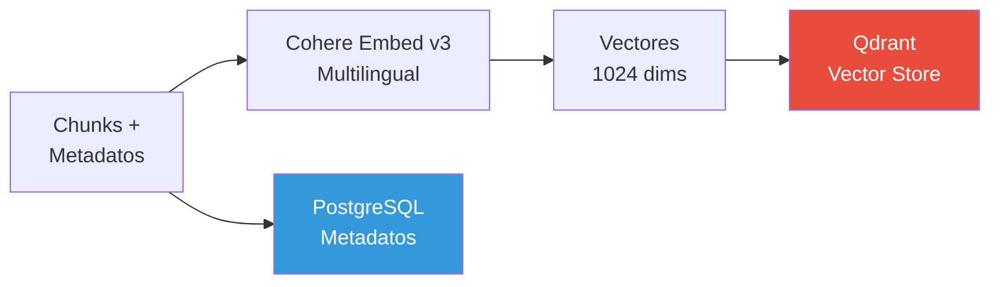
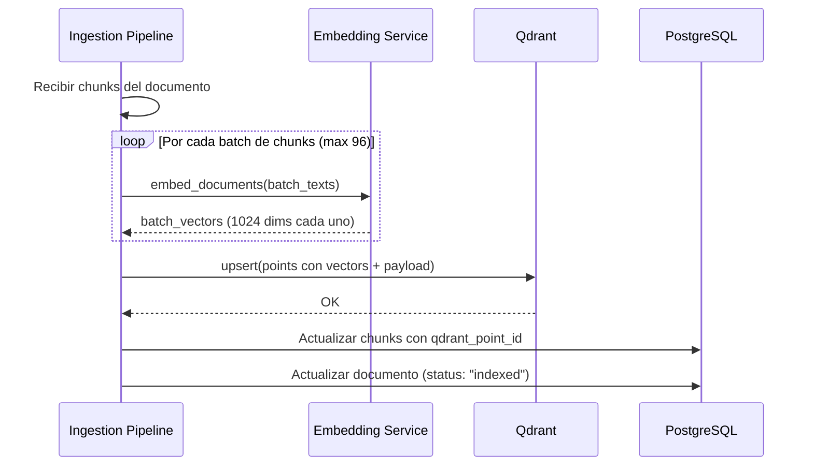

# 🔢 Fase 3: Indexación Vectorial

## Resumen

Transforma los chunks de texto en vectores numéricos (embeddings) y los almacena en Qdrant para búsqueda semántica rápida. Los metadatos se indexan en PostgreSQL para filtrado.



## 1. Modelo de Embeddings

### Cohere Embed v3 — Multilingual

| Propiedad | Valor |
|-----------|-------|
| **Modelo** | `embed-multilingual-v3.0` |
| **Dimensiones** | 1024 |
| **Idiomas** | 100+ (incluyendo ES, EN, PT) |
| **Max tokens input** | 512 tokens |
| **Input types** | `search_document` / `search_query` |
| **Batch size** | Hasta 96 textos por request |

### Input Types

Cohere Embed v3 diferencia entre embeddings de documentos y de queries:

| Input Type | Uso | Cuándo |
|------------|-----|--------|
| `search_document` | Indexación de chunks | Al procesar documentos |
| `search_query` | Búsqueda del usuario | Al recibir una pregunta |

```python
# rag/embeddings.py
import cohere

class EmbeddingService:
    def __init__(self, api_key: str, model: str = "embed-multilingual-v3.0"):
        self.client = cohere.AsyncClientV2(api_key=api_key)
        self.model = model

    async def embed_documents(self, texts: list[str]) -> list[list[float]]:
        """Genera embeddings para documentos (indexación)."""
        response = await self.client.embed(
            texts=texts,
            model=self.model,
            input_type="search_document",
            embedding_types=["float"],
        )
        return response.embeddings.float_

    async def embed_query(self, query: str) -> list[float]:
        """Genera embedding para una query (búsqueda)."""
        response = await self.client.embed(
            texts=[query],
            model=self.model,
            input_type="search_query",
            embedding_types=["float"],
        )
        return response.embeddings.float_[0]
```

## 2. Configuración de Qdrant

### Colección

```python
# rag/vector_store.py
from qdrant_client import QdrantClient, models

class VectorStore:
    def __init__(self, host: str, port: int, collection_name: str):
        self.client = QdrantClient(host=host, port=port)
        self.collection_name = collection_name

    async def create_collection(self):
        """Crea la colección si no existe."""
        self.client.create_collection(
            collection_name=self.collection_name,
            vectors_config=models.VectorParams(
                size=1024,           # Cohere Embed v3 dimensiones
                distance=models.Distance.COSINE,
            ),
            hnsw_config=models.HnswConfigDiff(
                m=16,                # Conexiones por nodo (default: 16)
                ef_construct=100,    # Calidad de construcción del índice
            ),
            optimizers_config=models.OptimizersConfigDiff(
                indexing_threshold=20000,  # Construir índice a partir de 20K puntos
            ),
        )
```

### Parámetros HNSW

| Parámetro | Valor | Impacto |
|-----------|-------|---------|
| `m` | 16 | Conexiones por nodo. Más alto = más preciso pero más memoria |
| `ef_construct` | 100 | Calidad de construcción. Más alto = índice más preciso, más lento de construir |
| `ef` (búsqueda) | 128 | Calidad de búsqueda. Más alto = más preciso, más lento |

## 3. Pipeline de Indexación



### Implementación

```python
# rag/vector_store.py (continuación)
import uuid
from qdrant_client import models

class VectorStore:
    # ... (init y create_collection)

    async def index_chunks(
        self, chunks: list[ChunkResult], vectors: list[list[float]]
    ) -> list[str]:
        """Indexa chunks con sus vectores en Qdrant."""
        points = []
        point_ids = []

        for chunk, vector in zip(chunks, vectors):
            point_id = str(uuid.uuid4())
            point_ids.append(point_id)

            points.append(models.PointStruct(
                id=point_id,
                vector=vector,
                payload={
                    "document_id": chunk.document_id,
                    "chunk_id": str(chunk.id),
                    "chunk_index": chunk.chunk_index,
                    "content": chunk.content,
                    "category_id": chunk.category_id,
                    "category_name": chunk.category_name,
                    "filename": chunk.filename,
                    "section_title": chunk.section_title,
                    "page_number": chunk.page_number,
                    "language": chunk.language,
                    "document_date": chunk.document_date,
                    "indexed_at": datetime.utcnow().isoformat(),
                },
            ))

        # Upsert en batches de 100
        BATCH_SIZE = 100
        for i in range(0, len(points), BATCH_SIZE):
            batch = points[i:i + BATCH_SIZE]
            self.client.upsert(
                collection_name=self.collection_name,
                points=batch,
            )

        return point_ids

    async def delete_document_points(self, document_id: str):
        """Elimina todos los puntos de un documento (para re-indexación)."""
        self.client.delete(
            collection_name=self.collection_name,
            points_selector=models.FilterSelector(
                filter=models.Filter(
                    must=[
                        models.FieldCondition(
                            key="document_id",
                            match=models.MatchValue(value=document_id),
                        )
                    ]
                )
            ),
        )
```

## 4. Indexación de Metadatos en PostgreSQL

Paralelamente a la indexación vectorial, los metadatos se guardan en PostgreSQL para:

- **Auditoría**: Saber exactamente qué documentos están indexados
- **Gestión**: Listar, filtrar y eliminar documentos
- **Referencia**: Vincular chunks de Qdrant con sus documentos originales

```python
# Al finalizar la indexación
async def update_document_status(
    db: AsyncSession, document_id: str, chunk_count: int
):
    await db.execute(
        update(Document)
        .where(Document.id == document_id)
        .values(
            status="indexed",
            chunk_count=chunk_count,
            indexed_at=datetime.utcnow(),
        )
    )
    await db.commit()
```

## 5. Payload Indexing (Filtros)

Para habilitar filtrado eficiente en Qdrant, se crean payload indexes:

```python
# Crear índices para los campos que se usarán como filtros
async def create_payload_indexes(self):
    fields = {
        "category_id": models.PayloadSchemaType.KEYWORD,
        "category_name": models.PayloadSchemaType.KEYWORD,
        "language": models.PayloadSchemaType.KEYWORD,
        "document_id": models.PayloadSchemaType.KEYWORD,
        "filename": models.PayloadSchemaType.KEYWORD,
    }
    for field_name, field_type in fields.items():
        self.client.create_payload_index(
            collection_name=self.collection_name,
            field_name=field_name,
            field_schema=field_type,
        )
```

## 6. Script de Indexación Masiva

```bash
# Indexar todos los documentos pendientes
python -m app.scripts.index_all --batch-size 50

# Re-indexar un documento específico
python -m app.scripts.reindex --document-id <uuid>

# Re-indexar toda una categoría
python -m app.scripts.reindex --category rh
```

## Verificación

### Test de Similitud Semántica

```python
# tests/integration/test_semantic_search.py
async def test_semantic_similarity():
    """Verifica que textos similares generan vectores cercanos."""
    # Textos sobre el mismo tema en diferentes idiomas
    texts = [
        "Política de vacaciones de la empresa",          # ES
        "Company vacation policy",                        # EN
        "Política de férias da empresa",                  # PT
    ]
    vectors = await embedding_service.embed_documents(texts)

    # La similitud coseno entre estos debe ser alta (> 0.7)
    for i in range(len(vectors)):
        for j in range(i + 1, len(vectors)):
            similarity = cosine_similarity(vectors[i], vectors[j])
            assert similarity > 0.7, f"Similitud {i}-{j}: {similarity}"
```
