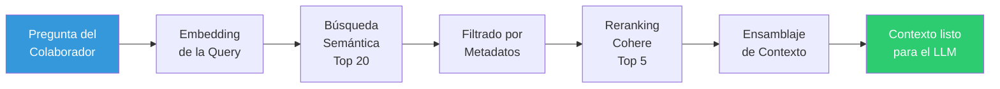
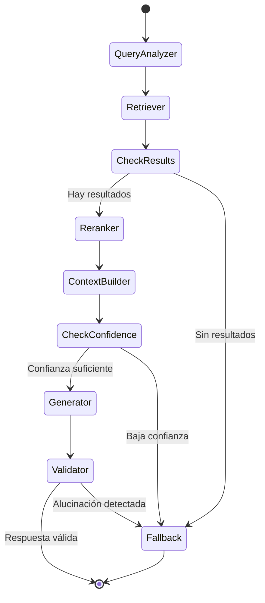

# 🔍 Fase 4: Capa de Recuperación (RAG)

## Resumen

La capa de recuperación decide **qué fragmentos de documentos** se entregan al LLM para generar la respuesta. Combina búsqueda semántica, filtrado por metadatos y reranking.



## 1. Transformación de la Pregunta en Embedding

```python
# agent/nodes/retriever.py
async def retrieve(state: AgentState) -> AgentState:
    query = state["query"]

    # Generar embedding de la pregunta usando input_type="search_query"
    query_embedding = await embedding_service.embed_query(query)

    return {**state, "query_embedding": query_embedding}
```

> **Importante**: Se usa `input_type="search_query"` (no `search_document`), ya que Cohere Embed v3 diferencia entre los dos para optimizar la búsqueda.

## 2. Búsqueda Semántica en Qdrant

La búsqueda semántica compara el vector de la pregunta con todos los vectores indexados usando **similitud de coseno**.

```python
# rag/vector_store.py
async def search(
    self,
    query_vector: list[float],
    top_k: int = 20,
    category_filter: str | None = None,
    language_filter: str | None = None,
    date_from: str | None = None,
) -> list[SearchResult]:
    """Búsqueda semántica con filtros opcionales."""

    # Construir filtro de Qdrant
    must_conditions = []

    if category_filter:
        must_conditions.append(
            models.FieldCondition(
                key="category_name",
                match=models.MatchValue(value=category_filter),
            )
        )

    if language_filter:
        must_conditions.append(
            models.FieldCondition(
                key="language",
                match=models.MatchValue(value=language_filter),
            )
        )

    if date_from:
        must_conditions.append(
            models.FieldCondition(
                key="document_date",
                range=models.Range(gte=date_from),
            )
        )

    search_filter = models.Filter(must=must_conditions) if must_conditions else None

    results = self.client.search(
        collection_name=self.collection_name,
        query_vector=query_vector,
        limit=top_k,
        query_filter=search_filter,
        with_payload=True,
        score_threshold=0.3,  # Umbral mínimo de relevancia
    )

    return [
        SearchResult(
            point_id=r.id,
            score=r.score,
            content=r.payload["content"],
            document_id=r.payload["document_id"],
            filename=r.payload["filename"],
            category_name=r.payload["category_name"],
            section_title=r.payload.get("section_title"),
            page_number=r.payload.get("page_number"),
        )
        for r in results
    ]
```

### Parámetros de Búsqueda

| Parámetro | Valor Default | Descripción |
|-----------|---------------|-------------|
| `top_k` | 20 | Cantidad de candidatos iniciales |
| `score_threshold` | 0.3 | Similitud mínima (0-1) para aceptar un resultado |
| `ef` (Qdrant HNSW) | 128 | Precisión de búsqueda vs. velocidad |

## 3. Filtrado por Metadatos

El filtrado se aplica **durante** la búsqueda vectorial (pre-filtering en Qdrant), lo cual es más eficiente que filtrar después.

### Tipos de Filtro Soportados

| Filtro | Campo | Ejemplo |
|--------|-------|---------|
| Categoría | `category_name` | Solo documentos de "Recursos Humanos" |
| Idioma | `language` | Solo documentos en español |
| Documento | `document_id` | Solo un documento específico |
| Fecha | `document_date` | Documentos de los últimos 12 meses |

### Detección Automática de Filtros

El nodo `query_analyzer` del grafo LangGraph puede detectar intención de filtro en la pregunta:

```python
# agent/nodes/query_analyzer.py
async def analyze_query(state: AgentState) -> AgentState:
    """Analiza la pregunta para extraer filtros implícitos."""
    query = state["query"]

    # Heurísticas simples para detectar categoría mencionada
    category_keywords = {
        "rh": ["vacaciones", "salario", "onboarding", "beneficios", "rh"],
        "financiero": ["reembolso", "factura", "presupuesto", "financiero"],
        "legal": ["contrato", "compliance", "normativa", "legal"],
        "ti": ["deploy", "código", "api", "sistema", "servidor"],
    }

    detected_category = None
    query_lower = query.lower()
    for category, keywords in category_keywords.items():
        if any(kw in query_lower for kw in keywords):
            detected_category = category
            break

    return {
        **state,
        "detected_category": detected_category,
    }
```

## 4. Reranking con Cohere Rerank

Después de la búsqueda vectorial (20 candidatos), el **reranker** evalúa cada candidato de forma más precisa:

```python
# rag/reranker.py
import cohere

class RerankerService:
    def __init__(self, api_key: str, model: str = "rerank-multilingual-v3.0"):
        self.client = cohere.AsyncClientV2(api_key=api_key)
        self.model = model

    async def rerank(
        self,
        query: str,
        documents: list[SearchResult],
        top_n: int = 5,
    ) -> list[RerankResult]:
        """Reclasifica los resultados por relevancia real."""
        if not documents:
            return []

        response = await self.client.rerank(
            query=query,
            documents=[doc.content for doc in documents],
            model=self.model,
            top_n=top_n,
            return_documents=False,
        )

        reranked = []
        for result in response.results:
            original = documents[result.index]
            reranked.append(RerankResult(
                content=original.content,
                relevance_score=original.score,      # Score vectorial original
                rerank_score=result.relevance_score,  # Score del reranker
                document_id=original.document_id,
                filename=original.filename,
                category_name=original.category_name,
                section_title=original.section_title,
                page_number=original.page_number,
            ))

        return reranked
```

### ¿Por qué Reranking?

| Aspecto | Búsqueda Vectorial | Reranking |
|---------|-------------------|-----------|
| **Velocidad** | Muy rápida (ms) | Más lenta (100-500ms) |
| **Precisión** | Buena (similitud general) | Excelente (relación pregunta-chunk) |
| **Candidatos** | Muchos (20+) | Pocos (3-5 mejores) |
| **Modelo** | Bi-encoder (embedding) | Cross-encoder (atención cruzada) |

La combinación es ideal: búsqueda vectorial para velocidad, reranking para precisión.

## 5. Ensamblaje del Contexto

Los chunks finales se organizan en un bloque de texto con metadatos, listo para el prompt del LLM:

```python
# agent/nodes/context_builder.py
async def build_context(state: AgentState) -> AgentState:
    """Ensambla el contexto de los chunks rerankeados."""
    chunks = state["reranked_chunks"]

    if not chunks:
        return {**state, "context": "", "needs_fallback": True}

    context_parts = []
    sources = []

    for i, chunk in enumerate(chunks, 1):
        source_ref = f"[Fuente {i}]"
        context_parts.append(
            f"{source_ref} (Documento: {chunk.filename}"
            f"{f', Sección: {chunk.section_title}' if chunk.section_title else ''}"
            f"{f', Página: {chunk.page_number}' if chunk.page_number else ''}"
            f", Categoría: {chunk.category_name})\n"
            f"{chunk.content}"
        )
        sources.append({
            "index": i,
            "filename": chunk.filename,
            "section_title": chunk.section_title,
            "page_number": chunk.page_number,
            "category": chunk.category_name,
            "relevance_score": chunk.relevance_score,
            "rerank_score": chunk.rerank_score,
            "snippet": chunk.content[:200],
        })

    context = "\n\n---\n\n".join(context_parts)

    return {
        **state,
        "context": context,
        "sources": sources,
        "needs_fallback": False,
    }
```

### Formato del Contexto (ejemplo)

```
[Fuente 1] (Documento: politica_vacaciones_2024.pdf, Sección: Días por antigüedad, Página: 5, Categoría: Recursos Humanos)
Los colaboradores con menos de 1 año de antigüedad tienen derecho a 15 días hábiles de vacaciones...

---

[Fuente 2] (Documento: manual_beneficios.docx, Sección: Vacaciones, Categoría: Recursos Humanos)
Para solicitar vacaciones, el colaborador debe enviar la solicitud con al menos 15 días de anticipación...
```

## 6. Grafo LangGraph — Flujo de Recuperación



## Métricas de Recuperación

| Métrica | Objetivo | Medición |
|---------|----------|----------|
| **Recall@20** | > 90% | ¿El chunk correcto está en los 20 candidatos? |
| **Precision@5** (post-rerank) | > 70% | ¿Los 5 finales son relevantes? |
| **Latencia total** | < 2s | Embedding + búsqueda + reranking |
| **Tasa de fallback** | < 20% | Preguntas sin contexto suficiente |
