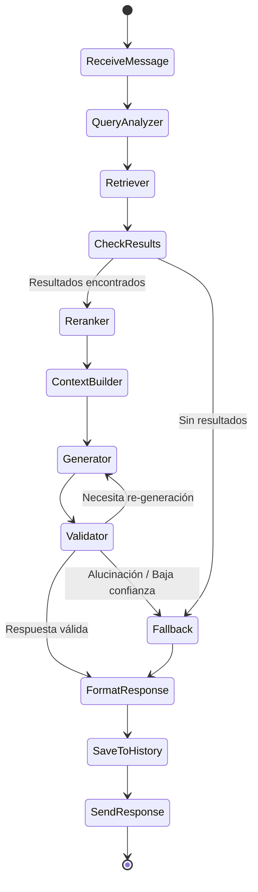

# 💬 Fase 5: Producción y Validación de Respuestas

## Resumen

El LLM recibe la pregunta + contexto recuperado y genera una respuesta basada en documentos, con citación de fuentes. Incluye validación anti-alucinación y fallback cuando no hay respuesta.

## 1. Generación de la Respuesta

### System Prompt

```python
# agent/prompts/system.py
SYSTEM_PROMPT = """Eres DocuAgent, un asistente de IA especializado en responder preguntas sobre la documentación interna de la empresa.

## Reglas Estrictas:
1. Responde ÚNICAMENTE con base en el contexto proporcionado. NO uses conocimiento externo.
2. Si el contexto no contiene la información necesaria, dilo claramente.
3. Cita siempre la fuente [Fuente N] de donde proviene cada dato.
4. Responde en el mismo idioma en que se hace la pregunta.
5. Sé conciso pero completo. No omitas información relevante del contexto.
6. Si hay información contradictoria entre fuentes, señálalo y cita ambas.
7. NO inventes datos, cifras, fechas o procedimientos que no estén en el contexto.

## Formato de Respuesta:
- Respuesta directa al inicio
- Información de apoyo si es necesario
- Referencias a las fuentes utilizadas al final
"""
```

### RAG Prompt Template

```python
# agent/prompts/rag.py
RAG_PROMPT = """## Contexto de Documentos:
{context}

## Historial de Conversación:
{chat_history}

## Pregunta del Colaborador:
{query}

## Tu Respuesta (basada únicamente en el contexto anterior):"""
```

### Nodo de Generación

```python
# agent/nodes/generator.py
async def generate_response(state: AgentState) -> AgentState:
    if state.get("needs_fallback"):
        return await fallback_response(state)

    provider = LLMProviderFactory.create(settings.llm_provider)

    response = await provider.generate(
        system_prompt=SYSTEM_PROMPT,
        user_prompt=RAG_PROMPT.format(
            context=state["context"],
            chat_history=format_chat_history(state["messages"]),
            query=state["query"],
        ),
        temperature=settings.llm_temperature,  # 0.1 para factual
        max_tokens=settings.llm_max_tokens,
    )

    return {
        **state,
        "response": response.content,
        "llm_provider": provider.name,
        "llm_model": provider.model,
        "tokens_input": response.usage.input_tokens,
        "tokens_output": response.usage.output_tokens,
    }
```

## 2. Citación de Fuentes

Cada respuesta incluye referencias a los documentos utilizados:

### Formato de Citación

```
📄 **Fuentes utilizadas:**

1. **politica_vacaciones_2024.pdf** — Sección: Días por antigüedad, Página: 5
   Categoría: Recursos Humanos | Relevancia: 0.92

2. **manual_beneficios.docx** — Sección: Vacaciones
   Categoría: Recursos Humanos | Relevancia: 0.87
```

### Estructura de la Respuesta API

```json
{
  "message": {
    "role": "assistant",
    "content": "Según la política de vacaciones vigente, los colaboradores con menos de 1 año de antigüedad tienen derecho a 15 días hábiles [Fuente 1]. Para solicitarlas, debe enviar la solicitud con al menos 15 días de anticipación a su supervisor directo [Fuente 2].",
    "sources": [
      {
        "index": 1,
        "filename": "politica_vacaciones_2024.pdf",
        "section_title": "Días por antigüedad",
        "page_number": 5,
        "category": "Recursos Humanos",
        "rerank_score": 0.92,
        "snippet": "Los colaboradores con menos de 1 año..."
      },
      {
        "index": 2,
        "filename": "manual_beneficios.docx",
        "section_title": "Vacaciones",
        "page_number": null,
        "category": "Recursos Humanos",
        "rerank_score": 0.87,
        "snippet": "Para solicitar vacaciones, el colaborador..."
      }
    ],
    "confidence": 0.89,
    "is_fallback": false,
    "response_time_ms": 2340,
    "provider": "openai",
    "model": "gpt-4o-mini"
  },
  "session_id": "abc-123"
}
```

## 3. Validación y Control de Alucinación

### Técnicas Implementadas

| Técnica | Descripción | Implementación |
|---------|-------------|----------------|
| **Restricción por prompt** | Instruir al LLM a no usar conocimiento externo | System prompt estricto |
| **Umbral de confianza** | No responder si la búsqueda no encuentra nada relevante | `score_threshold=0.3` en Qdrant |
| **Verificación de consistencia** | Verificar que la respuesta se basa en el contexto | Nodo `validator` en LangGraph |
| **Temperature baja** | Reducir creatividad para respuestas factuales | `temperature=0.1` |

### Nodo de Validación

```python
# agent/nodes/validator.py
async def validate_response(state: AgentState) -> AgentState:
    """Valida que la respuesta es consistente con el contexto."""
    response = state["response"]
    context = state["context"]
    sources = state["sources"]

    # Verificación 1: La respuesta no debe estar vacía
    if not response or len(response.strip()) < 10:
        return {**state, "needs_fallback": True}

    # Verificación 2: Umbral de confianza del reranking
    max_rerank_score = max(
        (s.get("rerank_score", 0) for s in sources), default=0
    )
    if max_rerank_score < settings.confidence_threshold:
        return {**state, "needs_fallback": True}

    # Verificación 3: La respuesta menciona al menos una fuente
    if "[Fuente" not in response and sources:
        # Re-generar pidiendo citación explícita
        return {**state, "needs_regeneration": True}

    return {**state, "confidence": max_rerank_score}
```

## 4. Fallback

Cuando el agente no puede responder con confianza:

```python
# agent/nodes/generator.py
FALLBACK_RESPONSES = {
    "es": (
        "No encontré información suficiente en los documentos disponibles "
        "para responder tu pregunta con certeza.\n\n"
        "**Sugerencias:**\n"
        "- Intenta reformular tu pregunta con otros términos\n"
        "- Verifica si el documento que buscas ha sido cargado al sistema\n"
        "- Contacta al área responsable: {area_sugerida}\n\n"
        "_Si crees que esta información debería estar disponible, "
        "por favor proporciona feedback negativo en esta respuesta._"
    ),
    "en": (
        "I couldn't find enough information in the available documents "
        "to answer your question with certainty.\n\n"
        "**Suggestions:**\n"
        "- Try rephrasing your question\n"
        "- Check if the document you're looking for has been uploaded\n"
        "- Contact the responsible department: {area_sugerida}"
    ),
    "pt": (
        "Não encontrei informações suficientes nos documentos disponíveis "
        "para responder sua pergunta com certeza.\n\n"
        "**Sugestões:**\n"
        "- Tente reformular sua pergunta\n"
        "- Verifique se o documento foi carregado no sistema\n"
        "- Entre em contato com a área responsável: {area_sugerida}"
    ),
}

async def fallback_response(state: AgentState) -> AgentState:
    """Genera una respuesta de fallback honesta."""
    # Detectar idioma de la pregunta
    lang = detect_language(state["query"])
    template = FALLBACK_RESPONSES.get(lang, FALLBACK_RESPONSES["es"])

    # Sugerir área basándose en la categoría detectada
    area = state.get("detected_category", "el administrador del sistema")

    return {
        **state,
        "response": template.format(area_sugerida=area),
        "is_fallback": True,
        "confidence": 0.0,
        "sources": [],
    }
```

## 5. Formato de Respuesta por Canal

### Chat Web (principal)

```markdown
Según la política de vacaciones vigente [Fuente 1], los colaboradores
con menos de 1 año de antigüedad tienen derecho a **15 días hábiles**.

Para solicitarlas, debe enviar la solicitud con al menos 15 días
de anticipación a su supervisor directo [Fuente 2].

---

📄 **Fuentes:**
1. politica_vacaciones_2024.pdf — Pág. 5
2. manual_beneficios.docx — Sección: Vacaciones
```

### Streaming (WebSocket)

La respuesta se envía token por token para mejor UX:

```python
# Eventos WebSocket
{"type": "start", "session_id": "abc-123"}
{"type": "token", "content": "Según"}
{"type": "token", "content": " la"}
{"type": "token", "content": " política"}
# ... más tokens ...
{"type": "sources", "data": [{...}, {...}]}
{"type": "done", "confidence": 0.89, "response_time_ms": 2340}
```

## 6. Grafo Completo del Agente



## Métricas de Calidad

| Métrica | Objetivo | Medición |
|---------|----------|----------|
| Respuestas con fuente | > 90% | Respuestas no-fallback con citación |
| Feedback positivo | > 70% | Botones de feedback de usuarios |
| Tasa de fallback | < 20% | Respuestas de fallback / total |
| Alucinaciones detectadas | < 5% | Validaciones que rechazan la respuesta |
| Tiempo de respuesta total | < 10s | End-to-end incluyendo streaming |
