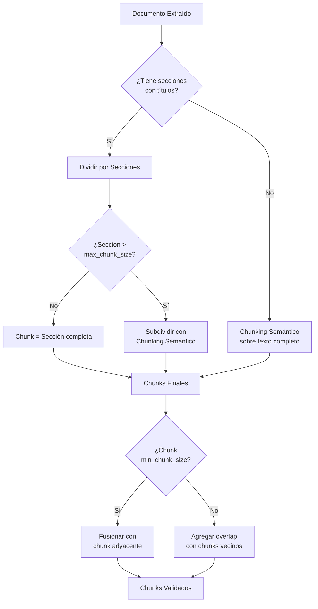

# 🧩 Estrategia de Chunking

## Visión General

El chunking es el proceso de dividir documentos en fragmentos (chunks) que se indexarán individualmente. La estrategia elegida es **chunking semántico**, que divide basándose en cambios de significado.

## Comparación de Estrategias

| Estrategia | Preserva Contexto | Complejidad | Costo | Elegida |
|------------|-------------------|-------------|-------|---------|
| Tamaño fijo | ❌ Bajo | ⭐ Simple | Gratis | No |
| Por estructura | ✅ Alto | ⭐⭐ Media | Gratis | Parcial |
| **Semántico** | ✅✅ Muy alto | ⭐⭐⭐ Alta | API calls | **Sí** |
| Recursivo | ✅ Medio | ⭐⭐ Media | Gratis | Fallback |

## Estrategia Implementada

### Flujo de Decisión



### Parámetros

```python
class ChunkingConfig:
    min_chunk_size: int = 200       # Caracteres mínimos por chunk
    max_chunk_size: int = 1500      # Caracteres máximos por chunk
    overlap_size: int = 100         # Superposición entre chunks
    similarity_threshold: float = 0.5  # Umbral para detectar cambio de tema
    prefer_sections: bool = True    # Priorizar división por secciones
```

## Chunking Semántico — Cómo Funciona

1. **Dividir el texto en oraciones**
2. **Generar embeddings** para cada grupo de oraciones (ventana deslizante)
3. **Calcular similitud** entre grupos consecutivos
4. **Detectar puntos de ruptura** donde la similitud cae por debajo del umbral
5. **Agrupar oraciones** entre puntos de ruptura como chunks

```python
from langchain_experimental.text_splitter import SemanticChunker
from langchain_cohere import CohereEmbeddings

embeddings = CohereEmbeddings(
    model="embed-multilingual-v3.0",
    cohere_api_key=settings.cohere_api_key,
)

semantic_chunker = SemanticChunker(
    embeddings=embeddings,
    breakpoint_threshold_type="percentile",
    breakpoint_threshold_amount=70,
    # 70th percentile: se crea un nuevo chunk cuando
    # la diferencia de similitud está en el top 30%
)

chunks = semantic_chunker.split_text(document_text)
```

## Ejemplos

### Documento con secciones claras (Word/PDF)
```
Sección 1: Política de Vacaciones     → Chunk 1 (sección completa)
Sección 2: Días por Antigüedad        → Chunk 2 (sección completa)
Sección 3: Procedimiento (muy largo)  → Chunks 3, 4, 5 (subdividido semánticamente)
```

### Documento sin secciones (texto plano)
```
Párrafo sobre reembolsos...            ┐
Párrafo sobre gastos elegibles...      ┘→ Chunk 1 (mismo tema)

Párrafo sobre límites de monto...      ┐
Párrafo sobre aprobaciones...          ┘→ Chunk 2 (mismo tema)

Párrafo sobre plazos de solicitud...   → Chunk 3 (tema diferente)
```

### Overlap entre chunks
```
Chunk 1: "...los gastos de transporte están cubiertos hasta $500 mensuales."
Chunk 2: "hasta $500 mensuales. Para gastos superiores, se requiere..."
          ^^^^^^^^^^^^^^^^^^^^^^ (overlap de ~100 chars)
```

## Consideraciones por Formato

| Formato | Estrategia Especial |
|---------|-------------------|
| **PDF** | Usar marcadores de página para metadata, no dividir tablas |
| **Word** | Usar estilos Heading como separadores de sección |
| **Excel** | Cada hoja = sección; agrupar filas temáticamente |
| **Markdown** | Usar headers (#, ##, ###) como separadores |
| **CSV** | Agrupar N filas por chunk (ej: 50 filas) con headers |
| **JSON** | Aplanar y dividir por claves de primer nivel |
