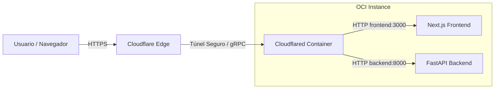

# 📋 Planificación de Infraestructura, Calidad y Gobernanza de Datos

Este documento define las especificaciones técnicas y operacionales del proyecto **DocuAgent** antes de iniciar la fase de desarrollo activa. Sirve como anexo de diseño para garantizar la estabilidad en entornos restringidos y establecer criterios de evaluación objetivos.

---

## 1. Planificación de Infraestructura y Servidor (Staging/Prod)

El despliegue se realizará sobre una sola instancia de **Oracle Cloud Infrastructure (OCI)** con las siguientes especificaciones:
* **Procesador:** 1 OCPU (arquitectura ARM Ampere o AMD Micro)
* **Memoria RAM:** 6 GB (ó 1 GB si se usa VM Micro, ajustado a 6 GB)
* **Almacenamiento:** 50 GB a 100 GB de volumen de arranque

### Distribución de Recursos por Contenedor (Podman)

Para asegurar que ningún servicio agote la memoria RAM de la máquina (lo que provocaría que el kernel matara procesos mediante el OOM Killer), se configuran límites estrictos en el archivo Compose:

| Servicio | Imagen / Origen | Límite RAM Sugerido | Límite CPU | Rol en el Stack |
| :--- | :--- | :--- | :--- | :--- |
| **docuagent-frontend** | `Next.js 15` (Custom) | 300 MB | 0.5 OCPU | Interfaz de usuario (SSR + CSR) |
| **docuagent-backend** | `FastAPI` (Custom) | 250 MB | 0.5 OCPU | Orquestación, API e Ingesta |
| **docuagent-postgres** | `PostgreSQL 16-alpine` | 150 MB | 0.2 OCPU | Metadatos y logs relacionales |
| **docuagent-qdrant** | `Qdrant v1.10.0` | 300 MB | 0.4 OCPU | Base de datos vectorial |
| **docuagent-tunnel** | `cloudflare/cloudflared` | 80 MB | 0.1 OCPU | Túnel y enrutamiento perimetral |

> [!NOTE]
> El total asignado con límites máximos es de **~1.1 GB RAM**, permitiendo que el sistema operativo y el motor de Podman operen holgadamente con los 6 GB disponibles.

### Justificación de Arquitectura Ingress (¿Por qué no Nginx?)

En arquitecturas tradicionales en la nube, se despliega Nginx como proxy reverso para gestionar el enrutamiento y la terminación de certificados SSL. Sin embargo, para este proyecto en OCI se ha optado por **prescindir de Nginx local** en favor de la integración directa de **Cloudflare Tunnel (Cloudflared)**:



* **Menos sobrecarga:** Ahorramos el consumo de CPU y memoria de un contenedor Nginx extra.
* **Enrutamiento nativo por host:** Cloudflare realiza el mapeo de nombres de host (`dev.tu-dominio.dev` -> `http://frontend:3000` y `api-dev.tu-dominio.dev` -> `http://backend:8000`) en su red y lo envía a través del túnel directamente a los puertos del contenedor correspondiente.
* **SSL Automatizado:** Cloudflare gestiona y renueva los certificados SSL automáticamente en su borde, entregando tráfico seguro sin configuraciones complejas en el host.

### Mitigación de CPU en Compilación (Estrategia DevOps/GitOps)

La compilación de frontend Next.js (`npm run build`) es un proceso demandante de CPU. Ejecutar esto en un servidor de 1 OCPU provocaría la caída temporal de los servicios.
* **Solución:** Las imágenes de Podman se compilarán exclusivamente en los corredores de **GitHub Actions** (CI/CD) y se enviarán al registro de imágenes de OCI (**OCIR**).
* **Acción en el servidor:** El script `ops/docuagent.sh` solo realiza un `podman pull` y reinicia los contenedores. No hay compilación local en staging/producción.

---

## 2. Plan de Evaluación de Calidad RAG

Para medir el rendimiento de nuestro agente de IA de forma cuantitativa, se define un marco de evaluación utilizando **LangSmith** antes de comenzar a escribir las directivas del agente.

### Matriz de Métricas de Calidad

Definimos tres métricas clave (basadas en el estándar Ragas):

1. **Fidelidad de Respuesta (Faithfulness / Anti-alucinación):**
   * **Definición:** Mide si la respuesta generada por el LLM se basa *únicamente* en el contexto proporcionado por Qdrant.
   * **Objetivo:** $> 95\%$ (tolerancia cero a invenciones).
   * **Evaluación:** Verificación cruzada mediante un LLM evaluador que compara las oraciones de la respuesta con el contexto recuperado.

2. **Relevancia de la Respuesta (Answer Relevance):**
   * **Definición:** Mide si la respuesta generada aborda directamente la pregunta del usuario.
   * **Objetivo:** $> 85\%$.
   * **Evaluación:** El LLM evaluador genera preguntas hipotéticas basadas en la respuesta y mide la similitud semántica con la pregunta original del usuario.

3. **Precisión de Recuperación (Context Precision):**
   * **Definición:** Mide si los chunks recuperados por Qdrant y reordenados por Cohere Rerank son verdaderamente relevantes para responder la consulta.
   * **Objetivo:** $> 90\%$.

### Conjunto de Datos de Validación (Ground Truth)

Durante la Fase 1, se creará un archivo `tests/rag_ground_truth.json` con **30 preguntas y respuestas ideales** redactadas manualmente a partir de los documentos de prueba. Este archivo se usará para ejecutar pruebas de regresión automatizadas sobre el agente en LangSmith antes de mergear cambios críticos.

---

## 3. Gobernanza y Estructura de Datos (PostgreSQL y Qdrant)

### Base de Datos Relacional (PostgreSQL)
Maneja las relaciones de negocio, el registro histórico y la auditoría.

* **Esquema de Tablas Clave:**
  * `categories`: `id` (UUID), `name` (VARCHAR), `description` (TEXT), `created_at` (TIMESTAMP).
  * `documents`: `id` (UUID), `category_id` (FK), `filename` (VARCHAR), `file_hash` (VARCHAR, para evitar duplicados), `file_size` (INT), `status` (VARCHAR: *uploaded*, *extracted*, *indexed*, *failed*), `created_at`.
  * `chunks`: `id` (UUID), `document_id` (FK), `qdrant_point_id` (UUID), `content` (TEXT), `metadata_dump` (JSONB).
  * `chat_sessions`: `id` (UUID), `user_identifier` (VARCHAR), `created_at`.
  * `chat_messages`: `id` (UUID), `session_id` (FK), `role` (VARCHAR: *user*/*assistant*), `content` (TEXT), `tokens_used` (INT), `latency_ms` (INT), `created_at`.
  * `message_sources`: `id` (UUID), `message_id` (FK), `chunk_id` (FK), `similarity_score` (FLOAT).
  * `message_feedback`: `id` (UUID), `message_id` (FK), `is_positive` (BOOLEAN), `comment` (TEXT), `created_at`.

### Base de Datos Vectorial (Qdrant)
* **Colección única:** `documents`
* **Métrica de Distancia:** Cosine Similarity
* **Tamaño del vector:** 1024 dimensiones (específico de `embed-multilingual-v3.0`)
* **Indexación Payload (Filtros rápidos):** Índices de tipo Keyword configurados en Qdrant para:
  * `category_id`
  * `language`
  * `document_id`

---

## 4. Gobernanza de Errores y API Response

Para asegurar una integración limpia y profesional entre el Backend (FastAPI) y el Frontend (Next.js), se implementa un esquema unificado de respuestas y manejo de errores.

### Formato de Respuesta Exitosa (REST API)
```json
{
  "success": true,
  "data": {
    "items": [],
    "total": 0
  }
}
```

### Formato de Respuesta de Error (REST API)
```json
{
  "success": false,
  "error": {
    "code": "ERR_FORMATO_DE_CODIGO",
    "message": "Mensaje legible para el usuario en su idioma.",
    "details": {}
  }
}
```

### Catálogo de Códigos de Error del Sistema

Para el portafolio, el uso de códigos de error estructurados facilita el debugging y el manejo de excepciones en la UI:

| Código de Error | Descripción | Acción del Frontend |
| :--- | :--- | :--- |
| `ERR_AUTH_FAILED` | Falló el inicio de sesión / contraseña incorrecta | Mostrar alerta de credenciales invalidas |
| `ERR_AUTH_2FA_REQUIRED` | Código TOTP 2FA requerido para completar login | Redirigir a vista de ingreso de token 2FA |
| `ERR_FILE_TOO_LARGE` | El archivo subido excede el límite (50 MB) | Bloquear subida y alertar tamaño máximo |
| `ERR_FILE_INVALID_FORMAT`| El archivo no tiene formato soportado | Mostrar lista de extensiones soportadas |
| `ERR_DUPLICATE_FILE` | El archivo ya ha sido subido anteriormente | Ofrecer opción de reindexar o cancelar |
| `ERR_VECTOR_DB_TIMEOUT` | La base de datos vectorial Qdrant no respondió | Mostrar banner temporal de "Servicio en mantenimiento" |
| `ERR_LLM_API_LIMIT` | El proveedor de LLM agotó sus cuotas o rate-limit | Intentar fallback automático de proveedor en backend |
| `ERR_CHAT_SESSION_EXPIRED`| La sesión de chat ha expirado en base de datos | Reiniciar contexto de chat en UI |

---

## 5. Próximos Pasos de Configuración Operacional

Al iniciar el desarrollo:
1. **Creación de la base de datos vacía:** Alembic generará automáticamente las tablas en PostgreSQL.
2. **Inicialización de la colección de Qdrant:** El backend comprobará si existe la colección `documents` al iniciar; de lo contrario, la creará con la configuración vectorial de 1024 dimensiones e índice de coseno.
3. **Carga del Dataset Inicial:** Se estructurará un directorio `backend/tests/data/` para colocar archivos PDF, MD y DOCX de ejemplo para el desarrollo del extractor.
