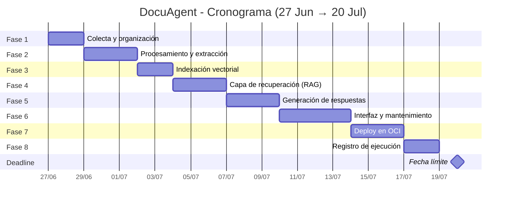

# 📅 Fases del Proyecto y Cronograma

## Fases del Proyecto

El proyecto sigue 8 fases secuenciales, donde cada fase construye sobre la anterior:

> **Fecha límite**: 20 de julio de 2026 (24 días de desarrollo)
> Se incluyen ~2 días de buffer distribuidos para imprevistos.

---

## Fase 1: Colecta y Organización de Documentos

**Duración**: 2 días (27-28 jun)
**Prioridad**: 🔴 Crítica

### Entregables
- [ ] Mapeo de fuentes de documentos
- [ ] Definición del sistema de categorías dinámicas
- [ ] Esquema de metadatos por documento
- [ ] Estructura de carpetas para documentos de ejemplo/prueba
- [ ] Modelo de datos para gestión de documentos (PostgreSQL)
- [ ] API de carga manual de documentos

### Criterios de Aceptación
- Los documentos de prueba están organizados por categoría
- El modelo de datos soporta categorías dinámicas
- Se puede subir un documento vía API y se persiste con sus metadatos

---

## Fase 2: Procesamiento y Extracción de Contenido

**Duración**: 3 días (29 jun - 1 jul)
**Prioridad**: 🔴 Crítica

### Entregables
- [ ] Extractores por formato (PDF, Word, Excel, Markdown, CSV, JSON, TXT)
- [ ] Pipeline de limpieza de texto
- [ ] Sistema de chunking semántico
- [ ] Atribución automática de metadatos a cada chunk
- [ ] Tests unitarios para cada extractor

### Criterios de Aceptación
- Cada formato soportado se extrae correctamente
- Los chunks preservan el contexto semántico
- Cada chunk tiene metadatos asociados (categoría, archivo, fecha, autor)

---

## Fase 3: Indexación Vectorial

**Duración**: 2 días (2-3 jul)
**Prioridad**: 🔴 Crítica

### Entregables
- [ ] Integración con Cohere Embed v3 (multilingual)
- [ ] Configuración de Qdrant (colección, índice HNSW)
- [ ] Pipeline de generación de embeddings
- [ ] Indexación de metadatos en PostgreSQL
- [ ] Script de indexación masiva
- [ ] Tests de similitud semántica

### Criterios de Aceptación
- Los documentos se indexan exitosamente en Qdrant
- La búsqueda semántica devuelve resultados relevantes en ES/EN/PT
- Los metadatos se pueden usar como filtros

---

## Fase 4: Capa de Recuperación (RAG)

**Duración**: 3 días (4-6 jul)
**Prioridad**: 🔴 Crítica

### Entregables
- [ ] Transformación de queries en embeddings
- [ ] Búsqueda semántica en Qdrant
- [ ] Filtrado por metadatos (categoría, fecha, etc.)
- [ ] Integración con Cohere Rerank
- [ ] Ensamblaje de contexto para el LLM
- [ ] LangGraph: nodos del grafo de recuperación
- [ ] Tests de retrieval quality

### Criterios de Aceptación
- La búsqueda semántica + reranking devuelve los fragmentos más relevantes
- El filtrado por metadatos funciona correctamente
- El contexto ensamblado es coherente y dentro del límite de tokens

---

## Fase 5: Producción y Validación de Respuestas

**Duración**: 3 días (7-9 jul)
**Prioridad**: 🔴 Crítica

### Entregables
- [ ] Sistema multi-proveedor LLM (OpenAI, Gemini, Claude, Ollama)
- [ ] Prompt engineering: system prompt + context injection
- [ ] Citación de fuentes en la respuesta
- [ ] Control de alucinaciones (umbral de confianza)
- [ ] Fallback cuando no hay respuesta
- [ ] LangGraph: grafo completo del agente
- [ ] Tests de calidad de respuesta

### Criterios de Aceptación
- El agente responde basándose únicamente en el contexto recuperado
- Cada respuesta incluye las fuentes utilizadas
- El agente admite cuando no tiene la información
- Se puede cambiar de proveedor LLM sin cambiar código

---

## Fase 6: Implantación, Interfaz y Mantenimiento

**Duración**: 4 días (10-13 jul)
**Prioridad**: 🟡 Alta

### Entregables
- [x] Frontend Next.js: landing page profesional
- [ ] Frontend Next.js: interfaz de chat conversacional
- [ ] Frontend Next.js: panel de carga de documentos
- [ ] Frontend Next.js: panel de administración (categorías, documentos)
- [ ] WebSocket para streaming de respuestas
- [ ] Memoria de sesión (historial conversacional)
- [ ] Botón de feedback (positivo/negativo) por respuesta
- [ ] Indicador de "agente de IA" en la interfaz
- [ ] Pipeline de actualización de documentos
- [ ] Responsive design

### Criterios de Aceptación
- La interfaz es funcional, profesional y responsive
- El chat mantiene historial dentro de la sesión
- Se pueden cargar y categorizar documentos desde la interfaz
- Las respuestas se muestran con fuentes y botón de feedback

---

## Fase 7: Deploy en la Nube (OCI)

**Duración**: 3 días (14-16 jul)
**Prioridad**: 🟡 Alta

### Entregables
- [x] Containerfiles (Podman) para backend, frontend, servicios
- [x] podman-compose.yml para desarrollo local
- [x] podman-compose.prod.yml para producción
- [ ] Push de imágenes a OCI Container Registry (OCIR)
- [ ] Configuración de OCI: VCN, subnets, security groups
- [ ] Despliegue en OCI Container Instances o Compute
- [ ] OCI Object Storage para documentos
- [ ] OCI Vault para secretos
- [ ] GitHub Actions workflow para CI/CD
- [ ] Configuración de dominio y Load Balancer

### Criterios de Aceptación
- El agente es accesible desde una URL pública
- Los contenedores se despliegan automáticamente con CI/CD
- Los secretos están en OCI Vault (no en variables de entorno)
- La infraestructura es reproducible

---

## Fase 8: Registro de Ejecución

**Duración**: 2 días (17-18 jul) + 2 días buffer
**Prioridad**: 🟢 Media

### Entregables
- [ ] Logs estructurados (JSON Lines) de todas las consultas
- [ ] Dashboard de métricas (tasa de respuesta, feedback, latencia)
- [ ] Capturas de pantalla del agente funcionando
- [ ] Video demostrativo del flujo completo
- [ ] Documentación de las pruebas realizadas
- [ ] README final actualizado

### Criterios de Aceptación
- Se tiene registro multimedia de la ejecución en la nube
- Los logs permiten auditoría completa (quién preguntó, qué se respondió, de dónde)
- El README refleja el estado final del proyecto

---

## Resumen de Dependencias entre Fases

